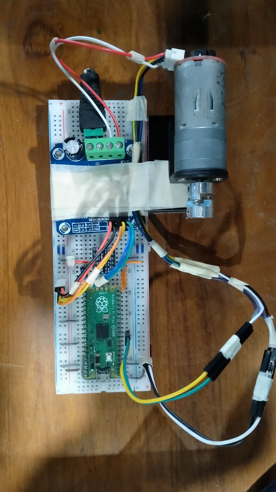
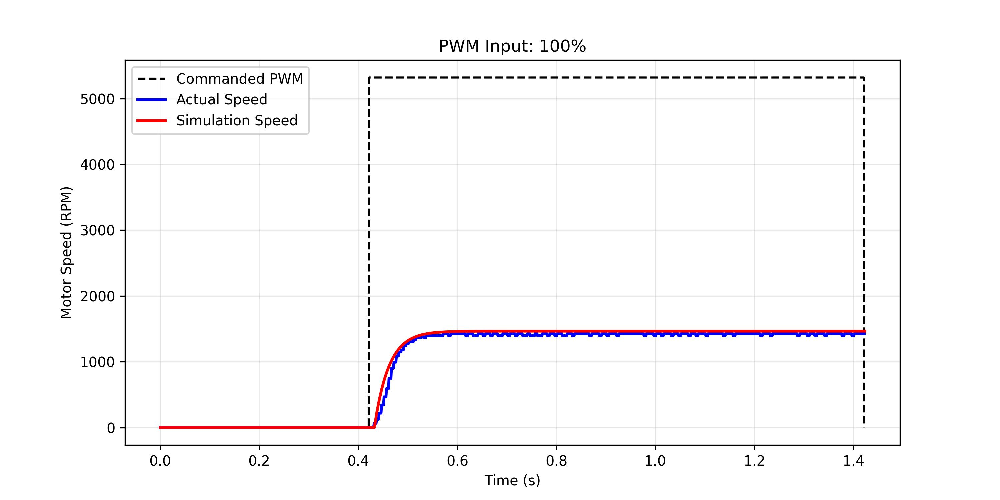
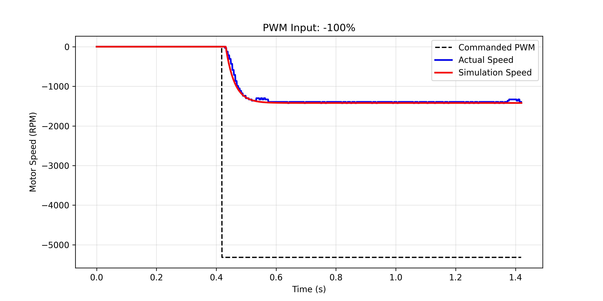
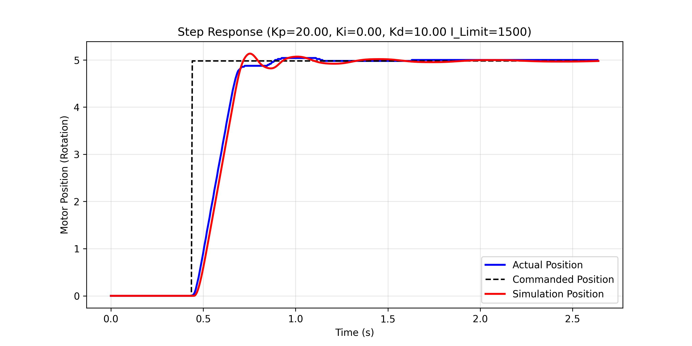
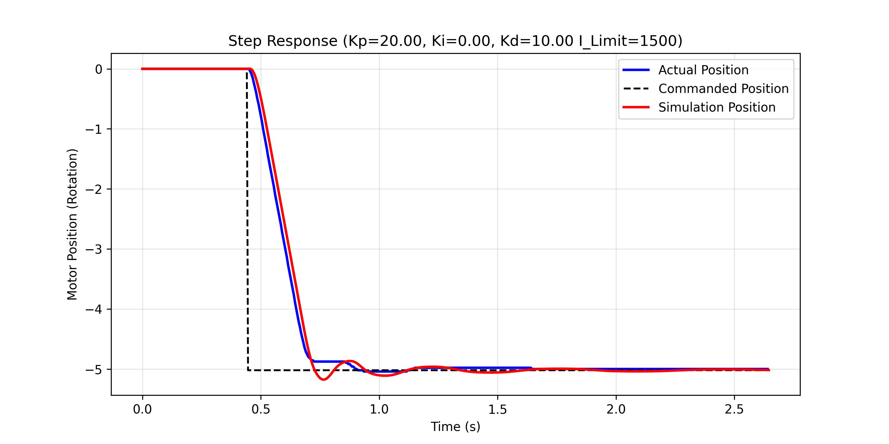

# DC Motor PID Control

<div align="center">
  
  <a href="README.md"></a>
  
  <a href="/docs/README.md">>" height="30"></a>
</div>
<div align="center">
  
  DC Motor Research Documentation
</div>
	
#

## Navigation
* [DC Motor Research Documentation](docs/README.md) : Motor Identification and PID Control
* [Build the RP2040 Firmware](firmware/README.md)
* [Python Script Installation](script/README.md)
##
  
DC Motor Speed and Position Control with Raspberry Pi Pico RP2040 and `embassy-rs` 🦀. This is the framework to write a firmware code with USB communication and flash storage feature. We use `Python` to communicate with the firmware API via serial communication. It's possible to scale up the project with another applications. Please refer to the [DC Motor Research Documentation](docs/README.md) for detail research on the DC Motor.

## Features
The table below shows the firmware features:
<div align="center">
	<table>
		<tr> 
			<th width = "250" align="center"> Features</th>
			<th width = "600" align="center"> Details </th>
		</tr>
		<!-- PID Motor Control -->
		<tr> 
	    	<td align="left"> PID Motor Control</td>
	    	<td align="left">  
		      <ul>
		        <li> Speed Control &rarr; Step Motion Profile Only</li>
		    	<li> Position Control:
		        	<ul>
		          		<li>Step Motion Profile</li>
		            	<li>Trapezoid Motion Profile</li>
					</ul>
		        </li>
				<li>Use Fixed-point Numbers Calculation via <code>fixed</code></li>
		      </ul>
	    	</td>
	  	</tr>
		<!-- USB Communication -->
		<tr> 
		  <td align="left"> Raw Byte Communication via USB CDC ACM</td>
		  <td align="left">  
			  <ul>
				<li>Get and Set Firmware Config</li>
				<li>Save Firmaware Config on the Flash Memory</li>
				<li>Controlling Motor based on PID Control Mode</li>
				<li>Firmware Logger up to 1kHz sampling frequency</li>
			  </ul>
		  </td>
		</tr>
		<!-- Encoder Reading Method -->
		<tr> 
			<td align="left"> Encoder Reading Method</td>
		  	<td><ul><li> RP2040 PIO via <code>embassy_rp::pio_programs::rotary_encoder::PioEncoder</code></li></ul></td>
		</tr>
		<!-- Flash Storage -->
		<tr> 
	    	<td align="left">Flash Storage</td>
	    	<td align="left"><ul><li>Save firware config on the flash memory to simulate EEPROM via <code>sequential_storage</code></li></ul></td>
	  	</tr>
		<!-- Multicore -->
		<tr> 
	    	<td align="left">Multicore</td>
	    	<td align="left"> 
				<ul>
					<li><code>CORE0</code> &rarr; USB Communication + Logger + Flash Storage</li>
					<li><code>CORE1</code> &rarr; Motor Control (200 Hz sampling rate)</li>
				</ul>
			</td>
	  	</tr>
	</table>
</div>

## Hardware
<p align="center">
    <br>
    
</p>

### Specification
<div align="center">
	<table>
	  <tr> 
	    <th width = "125" align="center"> Components</th>
	    <th width = "380" align="center"> Specification </th>
	  </tr>
	  <tr> 
	    <td align="left"> Microcontroller</td>
	    <td align="left"> Raspberry Pi Pico RP2040 </td>
	  </tr>
	  <tr> 
	    <td align="left"> Motor</td>
	    <td align="left"> Motor DC JGA25-370 12V Gearbox (1200 RPM)</td>
	  </tr>
	  <tr> 
	    <td align="left"> Motor Driver</td>
	    <td align="left"> BTS7960 </td>
	  </tr>
	</table>
</div>

### GPIO Map
We can see the GPIO pin list on the `firmware/main/src/resources/gpio_list.rs`
<div align="center">
	<table>	
		<tr>
		    <th width = "200" align="center"> Pin Name </th>
		    <th width = "125" align="center"> Motor_0 Pin </th>
			<th width = "125" align="center"> Motor_1 Pin </th>
		</tr>
		<tr>
			<td align="left">Motor_PWM_CW_PIN</td>
			<td align="center"><code>GP15</code></td>
			<td align="center"><code>GP3</code></td>
		</tr>
		<tr>
			<td align="left">Motor_PWM_CCW_PIN</td>
			<td align="center"><code>GP14</code></td>
			<td align="center"><code>GP2</code></td>
		</tr>
		<tr>
			<td align="left">Encoder_PIN_A</td>
			<td align="center"><code>GP6</code></td>
			<td align="center"><code>GP4</code></td>
		</tr>
		<tr>
			<td align="left">Encoder_PIN_B</td>
			<td align="center"><code>GP7</code></td>
			<td align="center"><code>GP5</code></td>
		</tr>
		<tr>
			<td align="left">PWM Slice</td>
			<td align="center"><code>PWM_SLICE7</code></td>
			<td align="center"><code>PWM_SLICE1</code></td>
		</tr>
	</table>
	
</div>


## Getting Started
We have two main directories: `firmware` and `script` as shown on the graph below. To start with this project you can clone this repository and follows the instruction below.

```bash
.
├── assets
├── firmware
│   ├── main
│   │   └── src
│   │       ├── control
│   │       ├── resources
│   │       ├── tasks
|   |       └── main.rs # Primary RP2040 PID DC Motor Control
│   └── playground      # Experimental project (USB, Flash Storage)
└── script
	├── BasicFunction
	├── Board
	├── Config
	├── DeviceOpFuncs 	# Device OP file folder to call the firmware API
	├── FWLogger
	├── Tool
	└── run.py      	# Python Script to Communicate with the Firmware
```

### `firmware` 
- Create the RP2040 firmware binary (`elf` or `uf2` ) to be flashed on the RP2040
- The main code of DC motor control is on `firmware/main`
- You can also try some features on `firmware/playground/` before merge them to the `main`.
- To build the project you can go to this link for [build firmware](firmware/README.md)

### `script`
- #### Firmware API
	- The API to communicate with RP2040 is on `script/DeviceOpFuncs/DCMotor.toml`
	- The structure of the communication is follows this pattern:
	```
	Command Format:
		Send Command        --> [COMMAND_HEADER:u8] [OP_CODE:u8] [PARAMETER]
		Response Command    --> [COMMAND_HEADER:u8] [ERROR_CODE:u8] [OP_CODE:u8] [RESPONSE_MESSAGE]

	Event Format:
		Received Event      --> [EVENT_HEADER:u8] [EVENT_CODE:u8] [MOTOR_ID:u8]

	Logger Format:
		Received Log Data   --> [LOGGER_HEADER:u8] [sequence:u8] [time_stamp:u32] [DATA_LOG:[i32;5]]
		DATA_LOG:[i32;5] =  [current_pos, current_speed, commanded_pos, commanded_speed, commanded_pwm]
	```
	- You can see the `TOML` file for more detail.
  
	- :warning: Please make sure to match the `TOML` file with the actual firmware op_code, input, output, and data type.

- #### Python Script
	- Python script to communicate with the RP2040 including the firmware logger by executing the `run.py`.
	- To run the python code you can type:
	  ```bash
	  python -i script/run.py
	  ```
	- Or you can use `uv` python package manager for automatically handle the dependencies with this command:
	  ```bash
	  cd script
      uv run python -i run.py
	  ```   

## Project Example
- On `script/run.py` you can create custom code to command the RP2040. We have created the example such as:

<table>
  <tr align = "center">
	<th  align="center" width=50>Example</th>
	<th  align="center">Positive Direction</th>
	<th  align="center">Negative Direction</th>
  </tr>

  <tr>
	<td align="center">Open Loop</td>
	<td> 
		
	</td>
	<td> 
		
	</td>
  </tr>

  <tr>
	<td align="center">Speed Control</td>
	<td> 
		
	</td>
	<td> 
		
	</td>
  </tr>

  <tr>
	<td align="center">Position Control</td>
	<td> 
		
	</td>
	<td> 
		
	</td>
  </tr>
</table>

#
<div align="center">
  
  <a href="README.md"></a>
  
  <a href="/docs/README.md">>" height="30"></a>
</div>
<div align="center">
  
  DC Motor Research Documentation
</div>
	
#