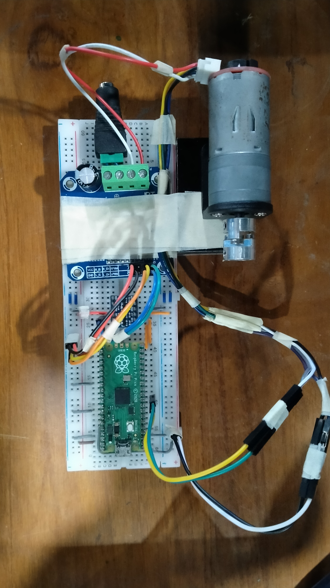
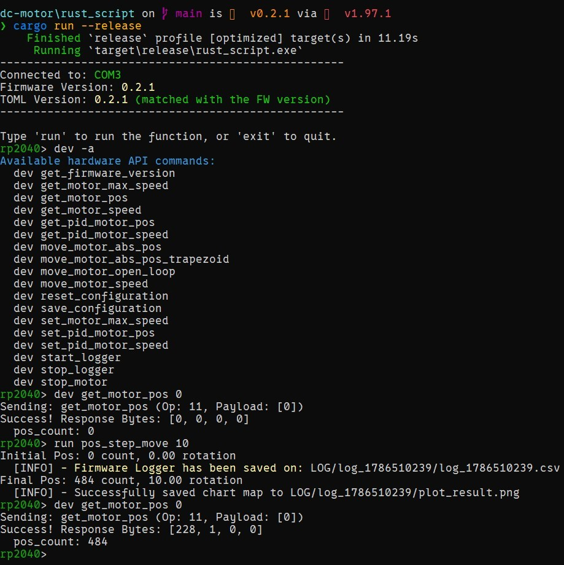
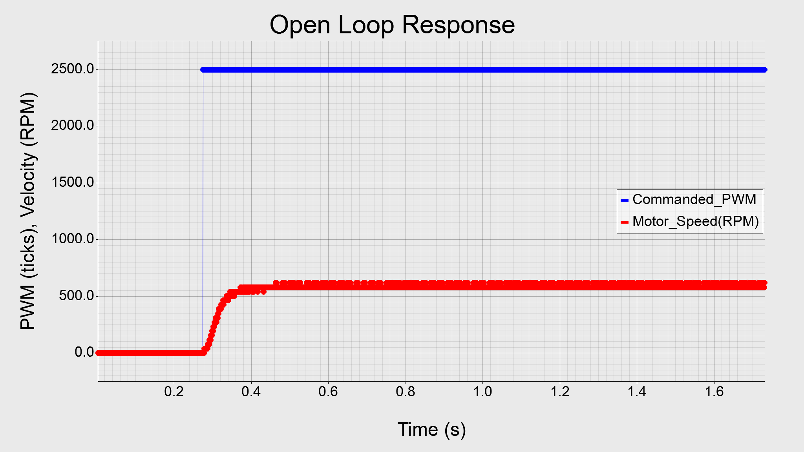
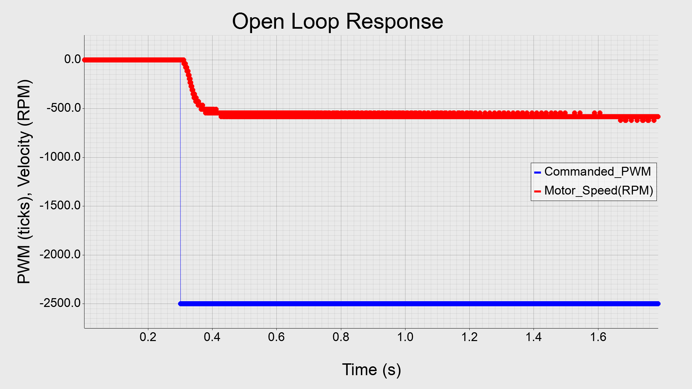
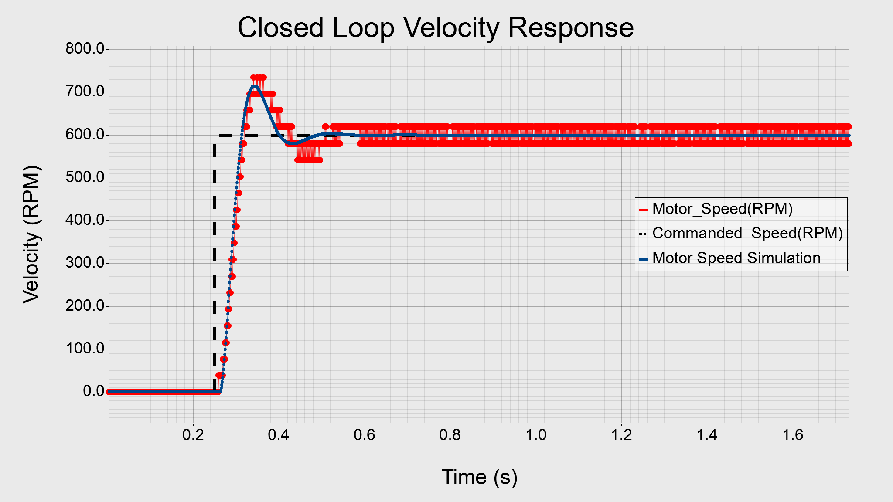
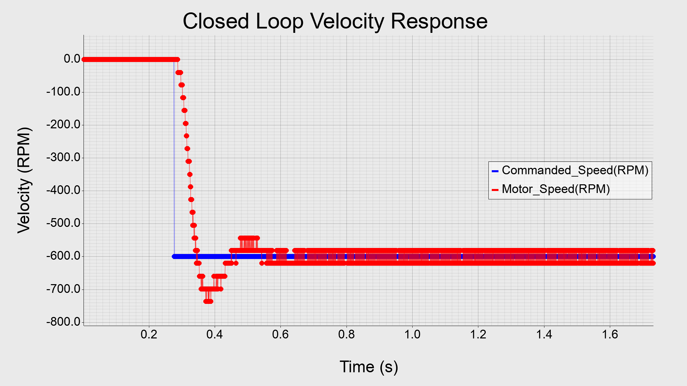
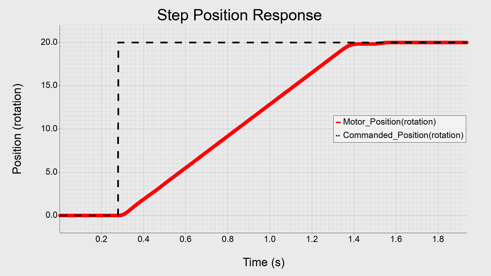
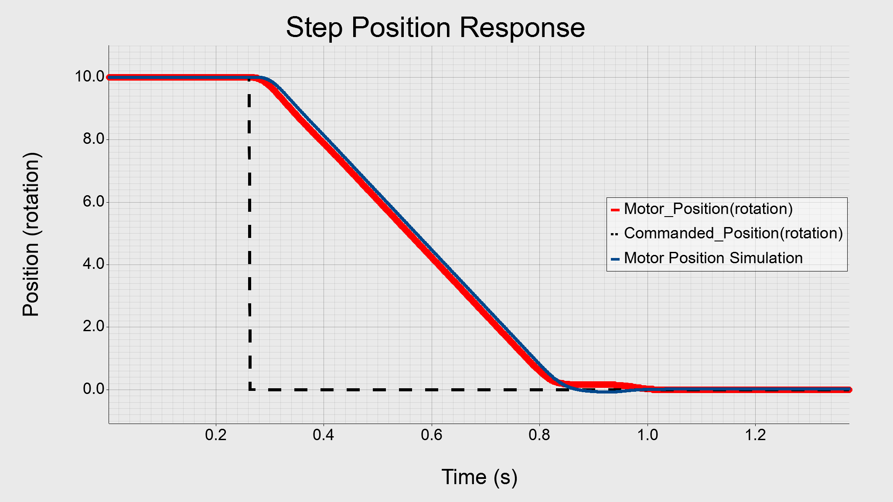

# DC Motor PID Control

<div align="center">
  
  <a href="README.md"></a>
  
  <a href="/docs/README.md">>" height="30"></a>
</div>
<div align="center">
  
  DC Motor Research Documentation
</div>
	
#
DC Motor Speed and Position Control with Raspberry Pi Pico RP2040 and `embassy-rs` 🦀. This is the framework to write a firmware code with USB communication and flash storage feature. We use `rust` application from the desktop as the host to communicate with the firmware API via serial communication. The graph below shows the communication diagram between host and firmware. All the firmware commands is stored on a toml file as the API between the host and firmware. The host is designed to automatically creates all the commands on the toml file as a rust function with it's argument and return value at compile time.

<p align="center">
    
</p>


For example there's a command on the toml file to get the motor position as shown below.

```toml
[[commands]]
args    = { motor_id = "u8" }
command = "get_motor_pos"
desc    = "Get motor position in Count"
op      = 11
ret     = { pos_count = "i32" }
```

On the host side, that `commands` is translated to a function that we can call with something like this:
```rust
let motor_id: u8 = 0;
let current_pos: i32 = pico.get_motor_pos(motor_id);
```

By using this architecture we can easily organize the changes from the firmware on the `toml` file without creating major changes on the host side and it's quite flexible to scale up the project. We can create `high-level script` that needs more computation resources (e.g. processing telemetry data, vision, SLAM, path planning) on the host side and keep microcontroller dealing with the low-level instruction. This architecture also possible to be integrated with the `ROS2`, but this topic is not included on this repository. The last important things is we need to make sure that the toml file is inline with the firmware. Wrong OP code, arguments, arguments type, and return value can lead to undefined behaviour of the firmware.

<!-- Please refer to the [DC Motor Research Documentation](docs/README.md) for detail research on the DC Motor. -->

## Features

The table below shows the firmware features:
<div align="center">
	<table>
		<tr> 
			<th width = "250" align="center"> Features</th>
			<th width = "600" align="center"> Details </th>
		</tr>
		<!-- PID Motor Control -->
		<tr> 
	    	<td align="left"> PID Motor Control</td>
	    	<td align="left">  
		      <ul>
		        <li> Speed Control &rarr; Step Motion Profile Only</li>
		    	<li> Position Control:
		        	<ul>
		          		<li>Step Motion Profile</li>
		            	<li>Trapezoid Motion Profile</li>
					</ul>
		        </li>
				<li>Use Fixed-point Numbers Calculation via <code>fixed</code></li>
		      </ul>
	    	</td>
	  	</tr>
		<!-- USB Communication -->
		<tr> 
		  <td align="left"> Raw Byte Communication via USB CDC ACM</td>
		  <td align="left">  
			  <ul>
				<li>Get and Set Firmware Config</li>
				<li>Save Firmaware Config on the Flash Memory</li>
				<li>Controlling Motor based on PID Control Mode</li>
				<li>Firmware Logger up to 1kHz sampling frequency</li>
			  </ul>
		  </td>
		</tr>
		<!-- Encoder Reading Method -->
		<tr> 
			<td align="left"> Encoder Reading Method</td>
		  	<td><ul><li> RP2040 PIO via <code>embassy_rp::pio_programs::rotary_encoder::PioEncoder</code></li></ul></td>
		</tr>
		<!-- Flash Storage -->
		<tr> 
	    	<td align="left">Flash Storage</td>
	    	<td align="left"><ul><li>Save firware config on the flash memory to simulate EEPROM via <code>sequential_storage</code></li></ul></td>
	  	</tr>
		<!-- Multicore -->
		<tr> 
	    	<td align="left">Multicore</td>
	    	<td align="left"> 
				<ul>
					<li><code>CORE0</code> &rarr; USB Communication + Logger + Flash Storage</li>
					<li><code>CORE1</code> &rarr; Motor Control (200 Hz sampling rate)</li>
				</ul>
			</td>
	  	</tr>
	</table>
</div>

## Hardware
<p align="center">
    <br>
    
	<br>Picture 1. Hardware Setup
</p>

### Specification
<div align="center">
	<table>
	  <tr> 
	    <th width = "125" align="center"> Components</th>
	    <th width = "380" align="center"> Specification </th>
	  </tr>
	  <tr> 
	    <td align="left"> Microcontroller</td>
	    <td align="left"> Raspberry Pi Pico RP2040 </td>
	  </tr>
	  <tr> 
	    <td align="left"> Motor</td>
	    <td align="left"> Motor DC JGA25-370 12V Gearbox (1200 RPM)</td>
	  </tr>
	  <tr> 
	    <td align="left"> Motor Driver</td>
	    <td align="left"> BTS7960 </td>
	  </tr>
	</table>
</div>

### GPIO Map
We can see the GPIO pin list on the `firmware/main/src/resources/gpio_list.rs`
<div align="center">
	<table>	
		<tr>
		    <th width = "200" align="center"> Pin Name </th>
		    <th width = "125" align="center"> Motor_0 Pin </th>
			<th width = "125" align="center"> Motor_1 Pin </th>
		</tr>
		<tr>
			<td align="left">Motor_PWM_CW_PIN</td>
			<td align="center"><code>GP15</code></td>
			<td align="center"><code>GP3</code></td>
		</tr>
		<tr>
			<td align="left">Motor_PWM_CCW_PIN</td>
			<td align="center"><code>GP14</code></td>
			<td align="center"><code>GP2</code></td>
		</tr>
		<tr>
			<td align="left">Encoder_PIN_A</td>
			<td align="center"><code>GP6</code></td>
			<td align="center"><code>GP4</code></td>
		</tr>
		<tr>
			<td align="left">Encoder_PIN_B</td>
			<td align="center"><code>GP7</code></td>
			<td align="center"><code>GP5</code></td>
		</tr>
		<tr>
			<td align="left">PWM Slice</td>
			<td align="center"><code>PWM_SLICE7</code></td>
			<td align="center"><code>PWM_SLICE1</code></td>
		</tr>
	</table>
	
</div>


## Getting Started
### Project Structure
We have two main directories: `firmware` and `script` as shown on the graph below. To start with this project you can clone this repository and follows the instruction below.

```bash
.
├── assets
├── docs  
├── firmware				# Firmware Code
│   ├── main				## Primary Firmware Project: RP2040 PID DC Motor Control
│   │   └── src
│   │       ├── control
│   │       ├── resources
│   │       └── tasks
│   └── playground 			## Experimental project (USB, Flash Storage)
│
└── rust_script				# Script to communicate with the RP2040
    ├── DeviceOpFuncs 		## Device OP file folder to call the firmware API
    ├── LOG					## Firmware Log Directory
    └── src
        ├── apps			## CLI apps builder
        ├── basic_function	## Basic function wrapper
        ├── board			## Manage all boards communication
        ├── config			## Manage all hardware configs
        ├── logger			## Firmware Logger
        ├── plotter			## Firmware CSV Plotter
        └── program			## Playground to create custom RP2040 program
```

### Software Dependencies
This project use `debian` to build the `uf2` file. This is also works on the native `Windows` and `WSL2/debian`.

- [Rust](https://www.rust-lang.org/tools/install)🦀
- [probe-rs](https://probe.rs/) &rarr; Embedded debugging toolkit
- [elf2uf2-rs](https://crates.io/crates/elf2uf2-rs/versions) &rarr; Converting the `elf` file to `uf2` file.
- [flip-link](https://github.com/knurling-rs/flip-link) &rarr; Add zero-cost stack overflow protection to your embedded programs
***

### Software Installation

- #### Installing `Rust`
  - Based on the official rust website, we can install the rust with this command:
    ```bash
    curl --proto '=https' --tlsv1.2 -sSf https://sh.rustup.rs | sh
    ```

- #### Installing `probe-rs`
  - :warning: Make sure that you didn’t accidentally run `cargo add probe-rs` (which adds it as a dependency) instead of correctly installing probe-rs
    ```bash
    curl --proto '=https' --tlsv1.2 -LsSf https://github.com/probe-rs/probe-rs/releases/latest/download/probe-rs-tools-installer.sh | sh
    ```

- #### Installing the `elf2uf2-rs`
  - To install this, we need to install the `libudev` first:
    ```bash
    sudo apt install -y pkg-config libusb-1.0-0-dev libftdi1-dev && sudo apt-get install libudev-dev
    ```
  - Then we can install the `elf2uf2-rs` by using this command:
    ```bash
    cargo install elf2uf2-rs
    ```

- #### Installing the `flip-link`
  - `flip-link` is available on [crates.io](crates.io). To install it, run:
    ```bash
    cargo install flip-link
    ```

### Cloning the Repository
- Clone this repository with this command:
  ```bash
  git clone https://github.com/tutla53/dc-motor.git 
  ```

### Build the Software

#### Firmware

To build the firmware you can choose to use the `probe-rs` if you use the debugger or using `elf2uf2-rs` to create the uf2 file then copy that file to the rp2040.

<table>
  <tr>
	<th width = "300" align="center"> Notes</th>
	<th width = "520" align="center"> probe-rs</th>
    <th width = "520" align="center"> elf2uf2-rs</th>
  </tr>
  <tr>
    <td> General commmand structure</td>
    <td><code>cargo run --release --package {pakage_name}</code></td>
    <td><code>cargo run-uf2 {pakage_name}</code></td>
  </tr>
  <tr>
    <td> Run <code>main</code></td>
    <td><code>cargo run --release --package main</code></td>
    <td><code>cargo run-uf2 main</code></td>
  </tr>
  <tr>
    <td> Run Playground</td>
    <td><code>cargo run --release --package usb_communication</code></td>
    <td><code>cargo run-uf2 usb_communication</code></td>
  </tr>
</table>

The uf2 file can be found on this directory:
```
firmware\target\thumbv6m-none-eabi\release\
```

For more detail on the development of firmware, you can go to this section: [Firmware Documentation](firmware/README.md).

#### Desktop Script
- Move the active directory to `rust_script`
	```
	cd rust_script
	```

- Then build the script by using this command:
	```
	cargo run --release
	```

On the desktop script we can try using two useful commands:

- Handling API by using `dev`
	- `dev -a` : list all avaliable commands from the toml file
	- `dev <command> <arguments>` : call a commands with it's arguments

- Run specific script by using `script`
	- `script -a` : list all avaliable function on `rust_script/src/program/script.rs`
	- `script <function> <arguments>` : call a function with it's arguments

The list of commands from toml and script from the rust code is automatically generated at a compile time with the `build.rs` script. So, for the development we only need to changet the toml file and the script file. No need to update major rust_script code. The image below shows the interface of the rust_script on the host side.

<p align="center">
    
	<br>Picture 2. Desktop App Interface
</p>

For more detail on the development of rust_script, you can go to this section: [Desktop Apps Documentation](rust_script/README.md).

## Project Example
<!-- - On `script/run.py` you can create custom code to command the RP2040. We have created the example such as: -->
We've created a sample script to test the basic movement of the DC motor and record the sensor value at 1 kHz sampling rate as shown on the code below:
```rust
pub fn speed_move(target_speed: f64) -> Result<(), Box<dyn std::error::Error>> {
    let shared = SHARED.get().expect("Shared resources not initialized!");

    // Speed Control Config
    let log_mask = LogMask::CommandedSpeed | LogMask::MotorSpeed;
    let time_sampling = 1;
    let chart_title = "Closed Loop Velocity Response";
    let y_label = "Velocity (RPM)";
    let duration_ms = 1500;

    // Clear Motor Event
    run_with_lock!(shared.m0 => clear_motor_event())?;

    // Start Fimware Logger
    run_with_lock!(shared.logger => start(log_mask, time_sampling))??;
    wait_ms(300);

    // Move Motor
    run_with_lock!(shared.m0 => move_motor_speed(Speed::from_rpm(target_speed)))?;
    wait_ms(duration_ms);

    // Stop Firmware Logger
    let (log_dir, file_dir) = run_with_lock!(shared.logger => stop())??;
    wait_ms(300);

    // Stop Motor
    run_with_lock!(shared.m0 => stop_motor())?;

    // Plot Firmware Logger
    plot::plot_csv(
        &log_dir,
        &file_dir,
        &chart_title,
        &y_label,
    )?;

    Ok(())
}
```

And the result can be shown on the table below including another script.

<table>
  <tr align = "center">
	<th  align="center" width=50>Example</th>
	<th  align="center">Positive Direction</th>
	<th  align="center">Negative Direction</th>
  </tr>

  <tr>
	<td align="center">Open Loop</td>
	<td> 
		
	</td>
	<td> 
		
	</td>
  </tr>

  <tr>
	<td align="center">Speed Control</td>
	<td> 
		
	</td>
	<td> 
		
	</td>
  </tr>

  <tr>
	<td align="center">Position Control</td>
	<td> 
		
	</td>
	<td> 
		
	</td>
  </tr>
</table>

#
<div align="center">
  
  <a href="README.md"></a>
  
  <a href="/docs/README.md">>" height="30"></a>
</div>
<div align="center">
  
  DC Motor Research Documentation
</div>
	
#
