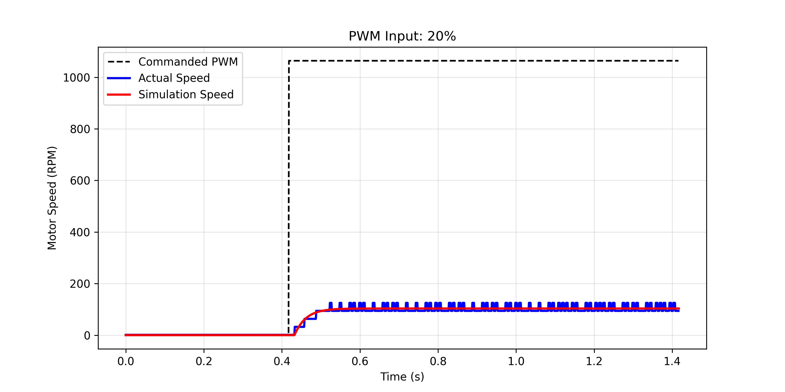
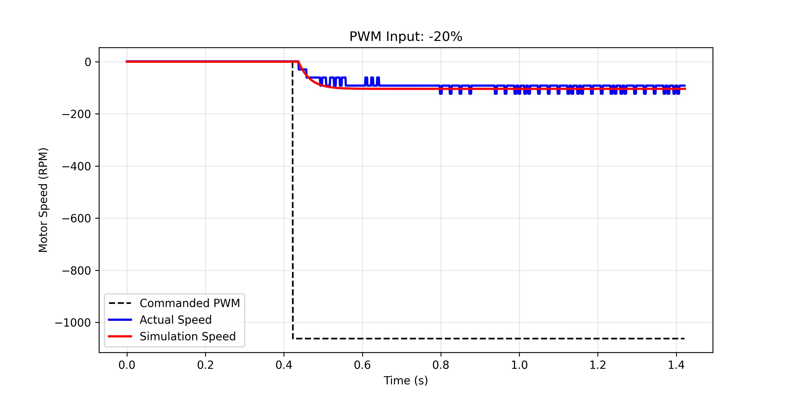
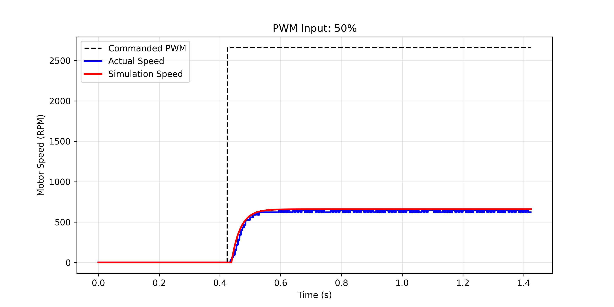
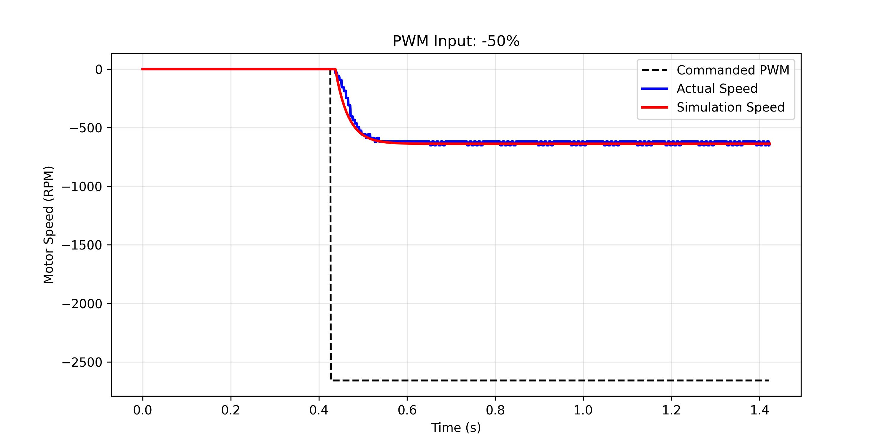
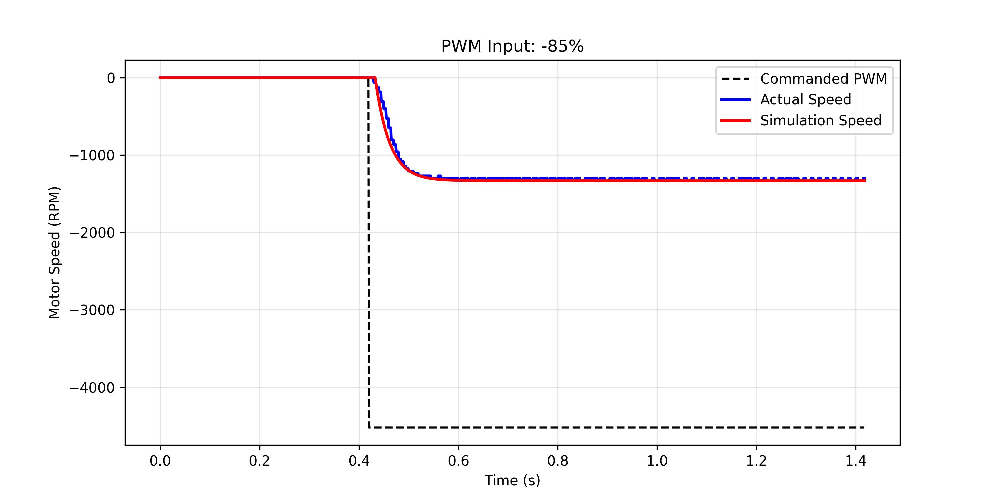

# System Identification

---
<table style="width:100%; border:none; text-align:center;">
  <tr>
    <td style="text-align:left; width:40%;">
      <a href="README.md">« Previous</a><br>
      Home
    </td>
    <td style="text-align:center; width:20%;">
      <a href="README.md">🏠 Home</a><br>
    </td>
    <td style="text-align:right; width:40%;">
      <a href="02-PID-Implementation.md">Next »</a><br>
      PID Implementation on RP2040
    </td>
  </tr>
</table>

---

## Method
### Simulation with `lfilter`

```python
import numpy as np
from scipy.signal import lfilter

def __open_loop_response(self, params, u, dt):        
    K, tau, L = params
    
    delay_samples = int(round(L / dt))
    
    # Shift the input signal u by 'delay_samples'
    if delay_samples > 0:
        u_delayed = np.zeros_like(u)
        u_delayed[delay_samples:] = u[:-delay_samples]
    else:
        u_delayed = u

    # Discrete-time coefficients
    a = np.exp(-dt / tau)
    b = K * (1 - a)
    
    # Simulate the first-order response
    y_sim = lfilter([0, b], [1, -a], u_delayed)
    return y_sim
```

## Result

## Verification

The table below shows the comparison between the DC Motor open loop firmware log and the simulation graph.  Based on that, we can say that we have successfully created the simulation model of the DC Motor with the minimum of error that cover for both direction and various speed target from 20% to 100% of PWM ticks.

<table>
  <tr align = "center">
    <th  align="center" width=50>PWM Input (%)</th>
    <th  align="center">Positive Direction</th>
    <th  align="center">Negative Direction</th>
  </tr>

  <tr>
    <td align="center"> 20 </td>
    <td> 
        
    </td>
    <td> 
        
    </td>
  </tr>

  <tr>
    <td align="center"> 50 </td>
    <td> 
        
    </td>
    <td> 
        
    </td>
  </tr>

  <tr>
    <td align="center"> 85 </td>
    <td> 
        
    </td>
    <td> 
        
    </td>
  </tr>

  <tr>
    <td align="center"> 100 </td>
    <td> 
        
    </td>
    <td> 
        
    </td>
  </tr>

</table>

---
<table style="width:100%; border:none; text-align:center;">
  <tr>
    <td style="text-align:left; width:40%;">
      <a href="README.md">« Previous</a><br>
      Home
    </td>
    <td style="text-align:center; width:20%;">
      <a href="README.md">🏠 Home</a><br>
    </td>
    <td style="text-align:right; width:40%;">
      <a href="02-PID-Implementation.md">Next »</a><br>
      PID Implementation on RP2040
    </td>
  </tr>
</table>

---