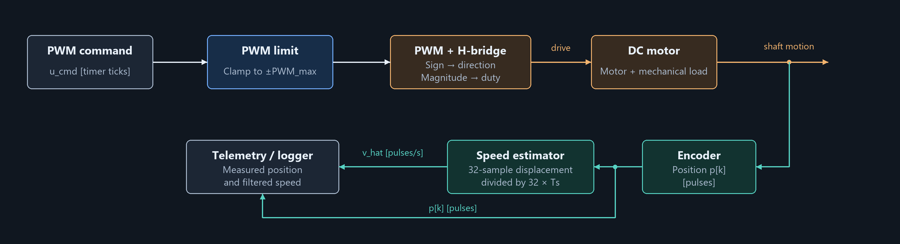
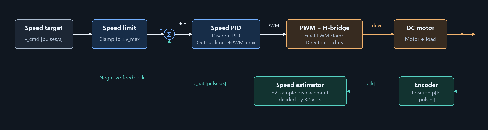
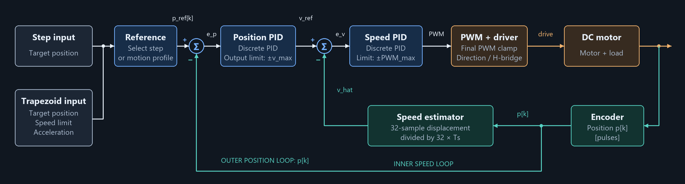

# Control System Design

<div align="center">
  <a href="01-System-Identification.md"></a>
  
  <a href="../README.md"></a>
  
  <a href="03-Control-Implementation.md">>" height="30"></a>
</div>
<div align="center">
  System Identification
  
  Control Implementation
</div>
    
#

## Design Highlights
<div align="center">
	<table>
		<tr> 
			<th width="200" align="center"> Parameter</th>
			<th width="700" align="center"> Description </th>
		</tr>
		<tr> 
      <td align="left"> Time-Constant</td>
      <td align="left"> 0.0265 s (from system identification)</td>
    </tr>     
		<tr> 
      <td align="left"> Identified Model Bandwidth</td>
      <td align="left"> 6.01 Hz</td>
    </tr>
		<tr> 
      <td align="left"> Control Sampling</td>
      <td align="left"> 
        Sampling Frequency: 1000 Hz <br>
        Sampling Period: 1 ms
      </td>
    </tr>    
		<tr> 
      <td align="left"> Main Control Loop Sampling Method</td>
      <td align="left"> Periodic asynchronous task using
        <a href="https://docs.embassy.dev/embassy-time/0.5.1/default/struct.Ticker.html"><code>embassy-time::Ticker</code></a>
      </td>
    </tr>     
		<tr> 
      <td align="left"> Position Measurement Method</td>
      <td align="left">
        <ul>
          <li>Implemented with 
          <a href ="https://docs.embassy.dev/embassy-rp/0.10.0/rp2040/pio_programs/rotary_encoder/struct.PioEncoder.html"><code>PioEncoder</code></a>
          to detect encoder rotation direction </li>
          <li>A dedicated task accumulates encoder counts to track position</li>
        </ul> 
      </td>
    </tr>
		<tr> 
      <td align="left"> Speed Measurement Method</td>
      <td align="left">
        <ul>
          <li>Get the position at the beginning of the control loop to get the delta position</li>
          <li>Update the current speed by using <code>moving average filter</code> with 32-sample delta position window</li>
          <li>
            Speed Estimator Implementation:
            <code> <a href = "../crates/motor-control/src/filter.rs">crates/motor-control/src/filter.rs</a> </code>
          </li>
        </ul> 
      </td>
    </tr>
		<tr> 
      <td align="left"> Fractional Arithmetic</td>
      <td align="left"> Fixed-point arithmetic represents fractional values as scaled integers using the
        <a href="https://crates.io/crates/fixed"><code>fixed</code> </a> crate
      </td>
    </tr>
		<tr> 
      <td align="left"> PID Control </td>
      <td align="left"> 
        Complete PID Implementation:
        <code> <a href = "../crates/motor-control/src/pid_control.rs">crates/motor-control/src/pid_control.rs</a> </code>
      </td>
    </tr>     
		<tr> 
      <td align="left"> Available Control Modes</td>
      <td align="left"> 
        <code>Open Loop</code>
        <ul>
          <li>Command Input: Step PWM</li>
          <li>Output: Motor Speed</li>
        </ul>
        <code>Speed Control</code>
        <ul>
          <li>Command Input: Step Speed</li>
          <li>Output: Motor Speed</li>
        </ul>
        <code>Position Control</code>
        <ul>
          <li>
            Command Input:
            <ul>
              <li>Step Position</li>
              <li>Position with Trapezoidal Speed Profile</li>
            </ul>
          </li>
          <li>Output: Motor Position</li>
          <li>
            Implementation of Trapezoidal Speed Motion Profile:
            <code> <a href = "../crates/motor-control/src/motion_profile.rs">crates/motor-control/src/motion_profile.rs</a> </code>          
          </li>
        </ul>
      </td>
    </tr>                                  
	</table>
</div>

## Sampling Period
The sampling period determines how often a discrete-time controller reads feedback and updates its output. A shorter period provides finer time resolution but leaves less processing time for each update. The sampling period must therefore balance the system dynamics and available computing resources. The following criteria guide the initial choice:
- Nyquist-Shannon Sampling Theorem
- Samples per Time Constant

### Nyquist-Shannon Sampling Theorem
The Nyquist-Shannon sampling theorem requires $f_s > 2 \cdot f_\text{max}$ for ideal reconstruction of a band-limited signal whose highest frequency is $f_\text{max}$. For an illustrative calculation, assume that the measured speed signal is band-limited to the identified model bandwidth.

The model bandwidth alone does not establish this signal bandlimit; frequency content above the bandwidth can still be present.

For the identified first-order model, the bandwidth is calculated as:

$$ f_{bandwidth} = \frac{1}{2 \pi \tau } (Hz)$$

Using the identified time constant of `0.0265 s` gives a model bandwidth of approximately `6.01 Hz`. This model describes the combined response from commanded PWM to filtered measured velocity, including the motor, driver, and velocity estimator. 
Under the illustrative bandlimit assumption above, Nyquist–Shannon requires $f_s > 12.02$ Hz or:

$$T_s < 83.19 \text{ ms}$$

This is a `theoretical reconstruction limit`, not a recommended controller sampling period.

### Samples per Time Constant
For a first-order system, the time constant ($\tau$) is the time required for the step response to complete 63.2% of its total change. The response reaches approximately 95% after $3\tau$ and 98% after $4\tau$. For the identified model, the filtered speed response reaches 63.2% of its total change in 26.5 ms after the identified delay. For this design, we choose at least ten controller updates per time constant as an initial time-resolution criterion:

$$T_s \leq 2.65 \text{ ms}$$

### Selecting the Sampling Period
This design uses a sampling period of `1 ms`, corresponding to a sampling frequency of `1 kHz`. It provides about 26.5 controller updates per identified time constant and satisfies the Nyquist requirement under the signal-bandlimit assumption stated above. At a 1 ms sampling period, assuming an effective sampling/computation delay of $1.5T_s$, the phase lag from that delay at 6.01 Hz is approximately $3.25^\circ$. This satisfies a chosen $10^\circ$ budget for that contribution. Complete control-loop assessment must account for speed-estimator dynamics and actual update latency at the controller’s gain crossover frequency, without counting effects already included in the identified model twice.

Reference: [control-delay criterion](https://imperix.com/doc/help/discrete-control-delay)

### Implementation

The discrete-time controller is designed using a constant sampling period ($T_s$). The implementation should therefore keep actual sampling intervals close to this period and limit the delay between reading feedback and applying the calculated output. Excessive timing variation can change the controller response relative to the discrete-time model. A hardware-timer interrupt like `Interrupt Service Routine (ISR)` is one option for scheduling control updates with low latency. However, its timing still depends on interrupt priorities, interrupt masking, and execution time. For this implementation, the control loop uses `embassy-time::Ticker` with a period of 1 ms, corresponding to a nominal sampling frequency of 1 kHz. This allows the control algorithm to execute as an asynchronous task alongside encoder servicing and the second motor controller.

The following simplified example shows the scheduling structure. The complete code can be found on: [`firmware/main/src/tasks/dc_motor.rs`](../firmware/main/src/tasks/dc_motor.rs)

```Rust
// PID Control Loop Structure

use embassy_time::{Duration, Ticker};

const TIME_SAMPLING_US: u64 = 1000;

#[embassy_executor::task]
async fn run_motor_task() {
    let mut ticker = Ticker::every(Duration::from_micros(TIME_SAMPLING_US));

    loop {
        ticker.next().await;

        // Read encoder feedback.
        // Estimate speed and calculate PID output.
        // Update PWM.    
    }
}
```

The ticker maintains a periodic schedule rather than starting a new 1 ms delay after each calculation (e.g. `delay()` on Arduino). While the next tick is pending, the executor can service other ready tasks without busy waiting. This provides a straightforward way to coordinate periodic control and asynchronous encoder processing. The 1 ms period is a scheduling target, not an automatic execution guarantee. Other tasks, interrupts, resource waits, or flash operations can delay an update. The complete control path must therefore be assessed for maximum scheduling delay, execution time, and missed deadlines. Overdue ticks may complete immediately, so the implementation also needs an explicit policy for missed updates rather than assuming that every iteration represents a normally spaced sample.

Reference: [Embassy Ticker](https://docs.embassy.dev/embassy-time/0.5.1/default/struct.Ticker.html)

## Encoder Reading Method
### Position 
Motor position is measured by accumulating rotary encoder counts, which can then be converted to angle or distance. Processing encoder events can become demanding as motor speed increases. For this motor:
- Rotary Encoder = 48.4 pulses/rotation
- Measured No-Load Speed = approximately 1500 RPM or 25 rotations/s
- Encoder Count Rate at This Speed = approximately 1210 pulses/s

The motor reached approximately 1500 RPM during a no-load measurement. This value is used here to estimate the encoder count rate and explain the speed-measurement design. It is not the configured control speed limit, and the achievable speed under load may be lower.

$$
\text{Encoder count rate} = 48.4 \times \frac{1500}{60} = 1210\text{ pulses/s}
$$

A dedicated task accumulates encoder counts for each position change. The `embassy-rp` crate provides `PioEncoder` to detect clockwise and counterclockwise rotation using PIO, reducing the CPU work required to monitor the two encoder pins. An example is available [here](https://github.com/embassy-rs/embassy/blob/main/examples/rp/src/bin/pio_rotary_encoder.rs). This project uses `AtomicI32` so that the encoder task can publish the current position while the control and logger tasks read it. The simplified example below shows the loop inside the encoder task. Imports, shared-variable initialization, and task setup are omitted. The complete implementation is in [`firmware/main/src/tasks/dc_motor.rs`](../firmware/main/src/tasks/dc_motor.rs).


```rust
// CURRENT_POS: AtomicI32 — shared encoder position [pulses]
// Inside the encoder task:
loop {
    let step = match encoder.read().await {
        Direction::Clockwise => 1,
        Direction::CounterClockwise => -1,
    };

    let current_pos = CURRENT_POS.load(Ordering::Relaxed);
    CURRENT_POS.store(current_pos.saturating_add(step), Ordering::Relaxed);
}
```

### Velocity
Motor velocity can be estimated in two ways: (1) counting pulses over a fixed time interval or (2) measuring the time required for a fixed number of pulses. The fixed-time method fits this control-loop architecture because it uses the position samples already available to the periodic control task:

$$v_{\text{raw}}[k]=\frac{p[k]-p[k-1]}{T_s}$$

A shorter measurement interval produces a larger velocity increment per encoder count, resulting in coarser velocity resolution. With a 1 ms sampling period, each additional count changes the raw estimate by:

$$ \Delta v=\frac{1}{0.001}=1000\text{ pulse/s} $$

For example, a motor running at a constant 800 pulses/s can produce raw readings of zero or 1000 pulses/s when sampled every 1 ms.

Assumptions:
- Motor is on steady-state velocity.
- Encoder count is initialized to zero at $t=0$.
- Successive encoder counts occur every 1.25 ms.
- Counts occurring exactly at a sampling boundary are included in this example. 
- The zero-time row represents initialization rather than a measured velocity.

Under these assumptions, the readings are:

<div align="center">
<table align="center">
  <thead>
    <tr><th>Time<br>(ms)</th><th>Count</th><th>Δcount</th><th>Velocity<br>(pulse/s)</th><th>Count Update<br>(ms)</th></tr>
  </thead>
  <tbody>
    <tr><td align="right">0</td><td align="right">0</td><td align="right">0</td><td align="right">0</td><td align="right">—</td></tr>
    <tr><td align="right">1</td><td align="right">0</td><td align="right">0</td><td align="right">0</td><td align="right">—</td></tr>
    <tr><td align="right">2</td><td align="right">1</td><td align="right">1</td><td align="right">1000</td><td align="right">1.25</td></tr>
    <tr><td align="right">3</td><td align="right">2</td><td align="right">1</td><td align="right">1000</td><td align="right">2.50</td></tr>
    <tr><td align="right">4</td><td align="right">3</td><td align="right">1</td><td align="right">1000</td><td align="right">3.75</td></tr>
    <tr><td align="right">5</td><td align="right">4</td><td align="right">1</td><td align="right">1000</td><td align="right">5.00</td></tr>
    <tr><td align="right">6</td><td align="right">4</td><td align="right">0</td><td align="right">0</td><td align="right">—</td></tr>
    <tr><td align="right">7</td><td align="right">5</td><td align="right">1</td><td align="right">1000</td><td align="right">6.25</td></tr>
    <tr><td align="right">8</td><td align="right">6</td><td align="right">1</td><td align="right">1000</td><td align="right">7.50</td></tr>
    <tr><td align="right">9</td><td align="right">7</td><td align="right">1</td><td align="right">1000</td><td align="right">8.75</td></tr>
    <tr><td align="right">10</td><td align="right">8</td><td align="right">1</td><td align="right">1000</td><td align="right">10.0</td></tr>
  </tbody>
</table>
</div>

To increase the resolution, we can increase the measurement interval. For instance, if we use 4 ms interval then the resolution is become 250 pulse/s and the measurement result contains three or four counts, producing 750 or 1000 pulse/s. The result is better but still not good enough to measure low velocity. The simplest solution is keep increasing the measurement interval but this method will reducing the responsiveness of the motor because it takes long time to update the velocity. Because of that we need to set some limit to improve the measurement resolution but still has good responsiveness. Let say we want to achieve the velocity resolution of `40 RPM` or around `32 pulse/second` (around 3% of maximum velocity). That means we need the measurement interval of around 32 ms.

A non-overlapping 32 ms measurement window would provide a new estimate every 32 ms. Instead, this implementation uses an overlapping window containing the latest 32 position increments and updates the estimate every 1 ms or usually called as `moving average filter`. This improves the update rate while retaining the resolution and delay associated with the longer measurement window. With 32 samples at a 1 ms sampling period, the moving average introduces 15.5 ms of additional group delay relative to the raw velocity estimates. The complete 32 ms measurement window is centered approximately 16 ms before the current update. Updating the estimate every millisecond does not remove this measurement lag. The formula of this filter is shown on the equation below:

$$ \hat v[k] =\frac{1}{N}\sum_{i=0}^{N-1}v_{\text{raw}}[k-i]$$

The implementation of the velocity calculation is shown on the listing below. The filter buffer is initially filled with zeros, so early outputs include a startup transient until 32 actual increments have been collected. Before the first update, `last_pos` must be initialized to the current encoder count to avoid treating an existing position offset as motion. The complete code can be found on: [`crates/motor-control/src/filter.rs`](../crates/motor-control/src/filter.rs)


```rust
pub struct MovingAverageFilter<const WINDOW: usize> {
    delta_buffer: [i32; WINDOW],
    delta_idx: usize,
    window_sum: i32,
    pub last_pos: i32,
}

impl<const WINDOW: usize> MovingAverageFilter<WINDOW> {
    pub fn new() -> Self {
        Self {
            delta_buffer: [0; WINDOW],
            delta_idx: 0,
            window_sum: 0,
            last_pos: 0,
        }
    }

    pub fn calculate_speed(&mut self, new_pos: i32) -> I16F16 {
        let delta_pos = new_pos - self.last_pos;
        self.last_pos = new_pos;

        // Moving Average Method
        self.window_sum -= self.delta_buffer[self.delta_idx];
        self.window_sum += delta_pos;
        self.delta_buffer[self.delta_idx] = delta_pos;
        self.delta_idx = (self.delta_idx + 1) % WINDOW;

        I16F16::from_num(self.window_sum)
    }
}
```

The filter returns the accumulated position change over the measurement window. The motor task converts this count to pulses per second by multiplying it by the precomputed factor $1/(T_s \cdot N)$ like in this code example below:

```rust
// On the config
pub const TIME_SAMPLING_US: u64 = 1000; 
pub const SPEED_FILTER_WINDOW: usize = 1 << 5;
pub const TICKS_TO_PPS_PER_WINDOWS: f32 =
    1_000_000.0_f32 / (TIME_SAMPLING_US as f32 * SPEED_FILTER_WINDOW as f32);

// On the Control Loop
let ticks_to_pps_per_windows = I16F16::from_num(TICKS_TO_PPS_PER_WINDOWS);
let current_pos_ticks = self.motor.get_current_pos();
let current_speed_ticks = self.filter.calculate_speed(current_pos_ticks);

// Updating Motor Status
self.current_speed_pps_fixed = current_speed_ticks * ticks_to_pps_per_windows;
```

## PID Control
### Fixed-Point Arithmetic

The RP2040 PID controller operates at a **1 kHz sampling frequency**, providing **1 ms between control updates**. On calculating PID, we will face intensive floating-point calculation that can create the computational overhead. To reduce computational overhead, the controller uses fixed-point arithmetic through Rust’s [`fixed`](https://crates.io/crates/fixed) crate instead of the RP2040 floating-point library on `bootROM`. Fixed-point represents fractional values as scaled integers, avoiding the exponent alignment and normalization required by software floating-point arithmetic. The speed controller uses `I16F16`, a 32-bit format with 16 fractional bits and a constant resolution of approximately $0.00001526$. As a reference baseline, a [Cornell RP2040 benchmark](https://people.ece.cornell.edu/land/courses/ece4760/RP2040/C_SDK_fixed_pt/index_fixed.html), running at **125 MHz** with **`-Ofast`** optimization, measured **138 µs for floating-point versus 40 µs for equivalent-format fixed-point** over 100 multiply-and-add iterations, including loop overhead. This represents approximately **3.4× faster execution**, or a **71% reduction in execution time** for that workload. If performed once per 1 ms control period, the benchmark workload would consume **13.8% versus 4.0% of one core’s processing time**, freeing 98 µs for other work. This illustrates how lower arithmetic overhead can increase the time available for sensor processing, filtering, and PWM updates. However, Cornell’s handwritten C benchmark is not a measurement of this Rust PID controller, which includes saturating arithmetic and additional control logic. The actual benefit must therefore be measured using the compiled implementation, while verifying that numerical range, quantization, and complete-loop execution time satisfy the controller’s requirements.

### PID Implementation
The code below shows the fixed-point PID implementation. `PIDController` is generic over the fixed-point type because the speed and position controllers use different formats. The expected speed input range of approximately ±1200 pulses/s fits within `I16F16`, a 32-bit format with a range from $-32768$ to $32768-2^{-16}$. The error, accumulated error, and gain products must also remain within the representable range to avoid unintended saturation.

Position commands use signed 32-bit encoder counts. The position controller therefore uses `I32F32` (64-bit fixed-point numbers) to represent this count range while retaining fractional precision. By using this we can easily calculate the PID output by calling the `compute` function. The complete implementation can be found on: [`crates/motor-control/src/pid_control.rs`](../crates/motor-control/src/pid_control.rs) 

```Rust
pub struct PIDController<T: Fixed> {
    kp: T,
    ki: T,
    kd: T,
    i_limit: T,
    integral: T,
    prev_error: T,
    max_output: i32,
}

impl<T: Fixed + Neg<Output = T>> PIDController<T> {
    #[inline(always)]
    pub fn compute(&mut self, command: i32, feedback: T) -> i32 {
        let error = T::from_num(command).saturating_sub(feedback);

        let next_integral = self.integral.saturating_add(error);
        self.integral = next_integral.clamp(-self.i_limit, self.i_limit);

        let derivative = error.saturating_sub(self.prev_error);
        self.prev_error = error;

        let p = self.kp.saturating_mul(error);
        let i = self.ki.saturating_mul(self.integral);
        let d = self.kd.saturating_mul(derivative);

        let sig = p.saturating_add(i).saturating_add(d);

        sig.to_num::<i32>().clamp(-self.max_output, self.max_output)
    }
}
```
The controller uses per-sample PID gains. Each update accumulates the error directly and calculates the derivative as the difference between the current and previous errors, without explicitly multiplying or dividing by the sampling period $T_s$. Therefore, when converting continuous-time parallel PID gains $K_p$, $K_i$, and $K_d$ to this implementation, use:

$$
\texttt{kp}=K_p,\qquad
\texttt{ki}=K_iT_s,\qquad
\texttt{kd}=\frac{K_d}{T_s}
$$

Here, $T_s$ is expressed in seconds. At the nominal sampling period of $1\,\text{ms}$, these become $\texttt{ki}=0.001K_i$ and $\texttt{kd}=1000K_d$. The implementation stores and uses these discrete gains directly; it does not perform this conversion internally. Gains already tuned using this implementation should not be converted again. If the sampling period changes, the gains must be reconsidered to preserve the intended controller response.

## Motor Control Modes
This project supports three motor control modes: `open loop`, `speed control`, and `position control`. Open loop and speed control accept step commands, while position control supports both step commands and firmware-generated motion profiles.

### Open Loop
The image below shows the block diagram of open-loop control. The input is a signed PWM command in timer ticks: its magnitude sets the PWM duty and its sign selects the rotation direction through the H-bridge. Motor speed is the observed output. This mode is used for system identification in the previous chapter. The encoder updates the reported position and speed but does not provide control feedback in this mode.

<div align="center"> 
  
</div>

### Speed Control
Speed control uses a closed-loop PID controller with estimated encoder speed as negative feedback. The input is a step speed command in pulses/s, and the PID generates the PWM command needed to track that speed. The image below shows the block diagram.

<div align="center"> 
  
</div>

### Position Control
Position control uses two cascaded PID loops. The position PID generates a target speed, and the speed PID generates the PWM command, as shown in the block diagram below. This control mode supports two input options: (1) a step position command and (2) a trapezoidal motion-profile command. A step command applies the target position directly as the position reference. A trapezoidal motion-profile command provides a target position (pulses), speed limit (pulses/s), and acceleration (pulses/s²), which the firmware uses to generate the position reference during each control cycle.

<div align="center"> 
  
</div>

The host can also generate motion profiles by streaming successive position targets. However, the timing of these updates depends on host scheduling and communication. If the command queue is full, the firmware returns an error to the host instead of silently dropping the command. Generating the profile in the firmware avoids the need to continuously stream position targets. When a trapezoidal motion command is received, the firmware creates a motion profile using the `current position`, `target position`, `speed limit`, and `acceleration`. It calculates the duration of the `acceleration`, `constant-speed`, and `deceleration` phases. If the travel distance is too short to reach the speed limit, it generates a `triangular velocity profile` instead. During each control cycle, the firmware advances the profile time and calculates a new position reference for the position PID. Once the profile ends, the reference remains at the target position. The generated profile assumes zero initial and final velocity. It uses the current position as its starting point but does not account for the motor’s current velocity.

The following two code snippets show profile creation and reference updates. Configuration and error handling are omitted; profile parameters use `I32F32`. The profile calculations are implemented in [`crates/motor-control/src/motion_profile.rs`](../crates/motor-control/src/motion_profile.rs), and their integration into the control loop is in [`firmware/main/src/tasks/dc_motor.rs`](../firmware/main/src/tasks/dc_motor.rs).

Create the profile when a new command arrives:

```rust
let profile = TrapezoidProfile::new(
    current_position, // pulses
    target_position,  // pulses
    speed_limit,      // pulses/s; limited to the motor's maximum speed
    acceleration,     // pulses/s²
)?;

let mut profile_time = I32F32::from_num(0);
```
Update the position reference during each control cycle:

```rust
profile_time += TIME_SAMPLING_S_FIXED;

let position_reference = profile.position(profile_time).to_num::<i32>();

let target_speed = position_control.compute(
    position_reference,
    current_position,
);
```
Here, “trapezoidal” describes the profile’s velocity shape, while `profile.position(...)` supplies the position reference used by the controller.


#
<div align="center">
  <a href="01-System-Identification.md"></a>
  
  <a href="../README.md"></a>
  
  <a href="03-Control-Implementation.md">>" height="30"></a>
</div>
<div align="center">
  System Identification
  
  Control Implementation
</div>
    
#
