# System Identification

<div align="center">
  <a href="01-Control-Implementation.md"></a>
  
  <a href="../README.md"></a>
  
  <a href="03-Speed-Control.md">>" height="30"></a>
</div>
<div align="center">
  Control Implementation
  
  Speed Control
</div>
    
#

## Method
### Simulation with `lfilter`

```python
import numpy as np
from scipy.signal import lfilter

def __open_loop_response(self, params, u, dt):        
    K, tau, L = params
    
    delay_samples = int(round(L / dt))
    
    # Shift the input signal u by 'delay_samples'
    if delay_samples > 0:
        u_delayed = np.zeros_like(u)
        u_delayed[delay_samples:] = u[:-delay_samples]
    else:
        u_delayed = u

    # Discrete-time coefficients
    a = np.exp(-dt / tau)
    b = K * (1 - a)
    
    # Simulate the first-order response
    y_sim = lfilter([0, b], [1, -a], u_delayed)
    return y_sim
```

## Result
The graph below shows the result of the system identification process. We can see that there's a deadband for the PWM below 25%. After the deadband to the maximum PWM input, we can see that the time-constant ($\tau$) and time-delay (L) has no significant changes. But for the steady-state gain (K) there's a nonlinearity behaviour based on the PWM input. After the deadband region, the value of K is increasing up to the 85% of the PWM Input, and then decreasing after that up to 100%. To analyzed further about the K, we will convert the graph from PWM vs K to PWM vs Speed.

<div align="center"> 
  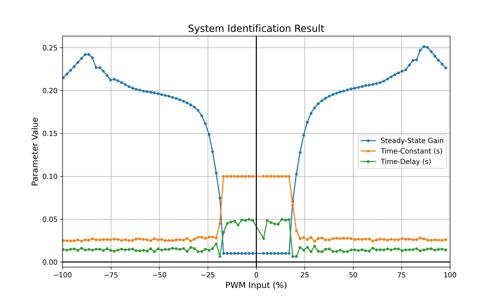</img>
</div>

### Motor Linearity
After we convert the data to PWM vs Motor Speed, we can see that the motor response is not linear for all the input range and not symmetric for different direction of the motor. Please note that the system that we mention here is the combination of the DC Motor and the motor driver.

#### Deadband Zone
At the low PWM input from 0 - 19% the motor is not moving because the current is not enough to overcome the static friction from the motor. Because of that we called this region as the `deadband`, because we cannot get the response. On the DC motor model we assume that the friction on the motor is only the viscous friction, but in reality the motor need to overcome the static coulomb friction from brush, bearing, and gear.

#### Nonlinear Transition
Just after the voltage input is increased, the current is strong enough to move the motor system. But during this transition, the friction constant is still not linear (see `Stribeck Effect`), which also makes the relationship between PWM input and motor speed is not linear. So, if we simulate the motor response on this region (19 - 30% of input) with the linear model, the the result may not accurate.

#### Linear Region
In this region (30 - 75% of input) the friction is fully moved to viscous friction and has a constant value. We can predict the system accurately with linear model on this region. We can estimate the value of K (steady-state constant) of the DC motor by calculating the slope of this region to build the linear model. This is the sweet spot of the DC motor and very recommended to operate and tune the DC motor on this region.

#### Pre-saturation
If we input voltage above 75%, some constant like the back-EMF constant starting to reach the limit and not give a linear response. Beside that, the H-bridge also almost reach the saturation region which resulting the output voltage is hardly to increase. This could also occur on the other components that begin sturate as the response to the temperature change. Because of that we can see that the speed changes is higher than the linear region as shown on the jump value of K on the Figure 1. 

#### Saturation
At this point, the input changes cannot increase the motor speed because many components is also saturating. 

<div align="center"> 
  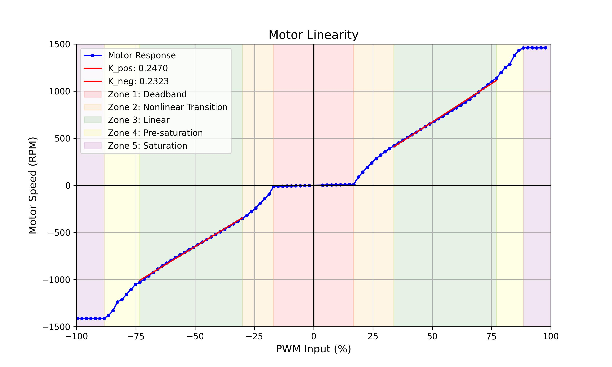</img>
</div>


## Verification

The table below shows the comparison between the DC Motor open loop firmware log and the simulation graph.  Based on that, we can say that we have successfully created the simulation model of the DC Motor with the minimum of error that cover for both direction and various speed.

<table>
  <tr align = "center">
    <th  align="center" width=50>PWM Input (%)</th>
    <th  align="center">Positive Direction</th>
    <th  align="center">Negative Direction</th>
  </tr>

  <tr>
    <td align="center"> 17 </td>
    <td> 
        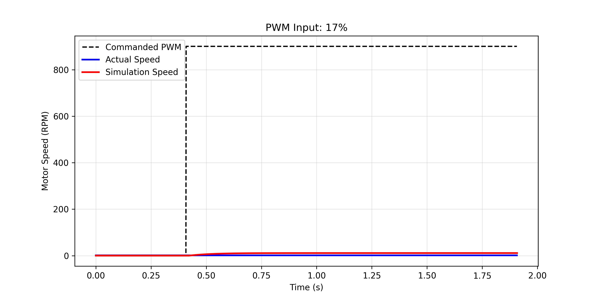
    </td>
    <td> 
        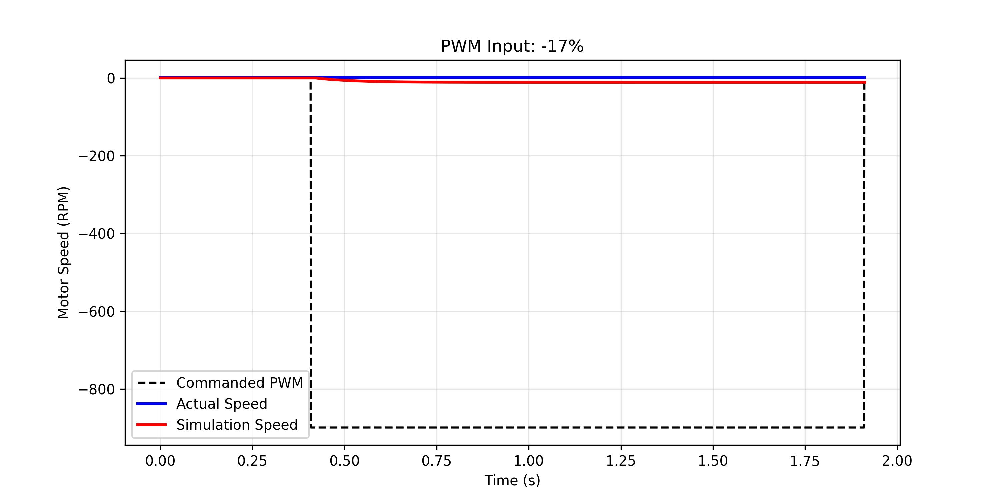
    </td>
  </tr>

  <tr>
    <td align="center"> 19 </td>
    <td> 
        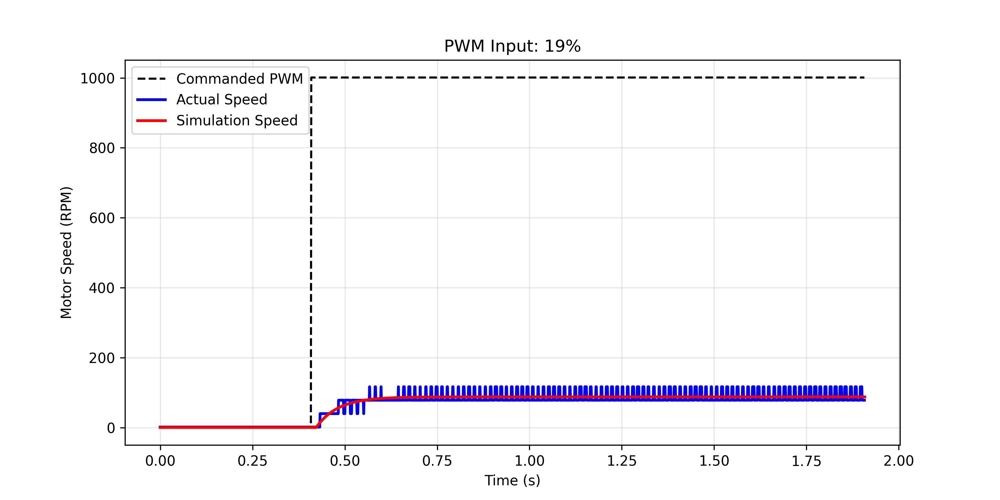
    </td>
    <td> 
        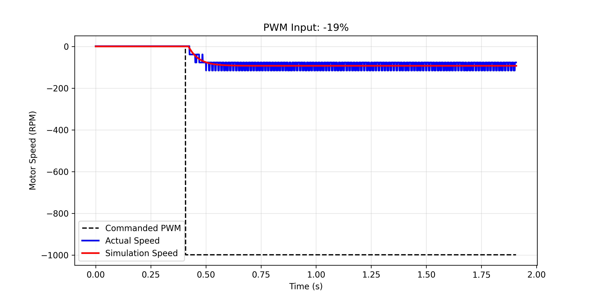
    </td>
  </tr>

  <tr>
    <td align="center"> 49 </td>
    <td> 
        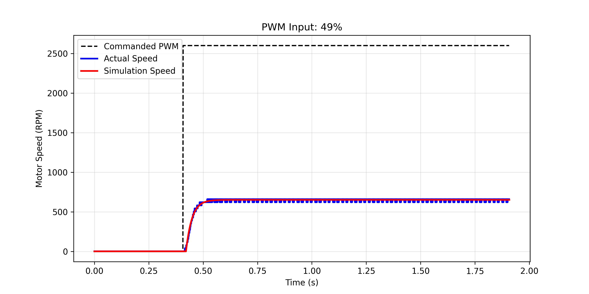
    </td>
    <td> 
        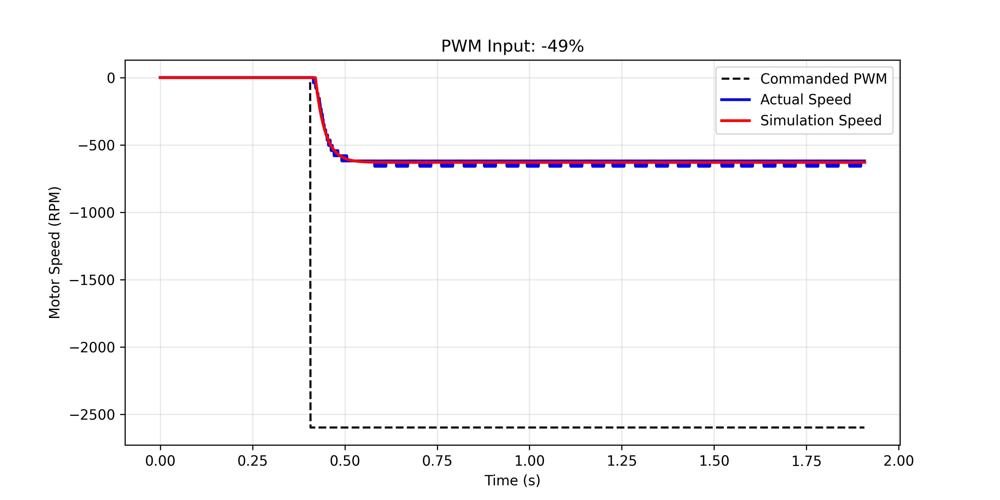
    </td>
  </tr>

  <tr>
    <td align="center"> 85 </td>
    <td> 
        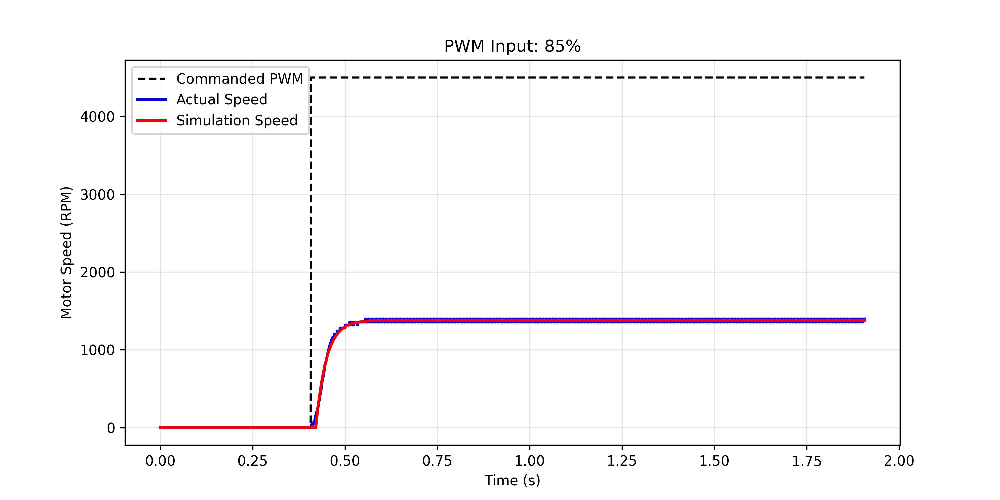
    </td>
    <td> 
        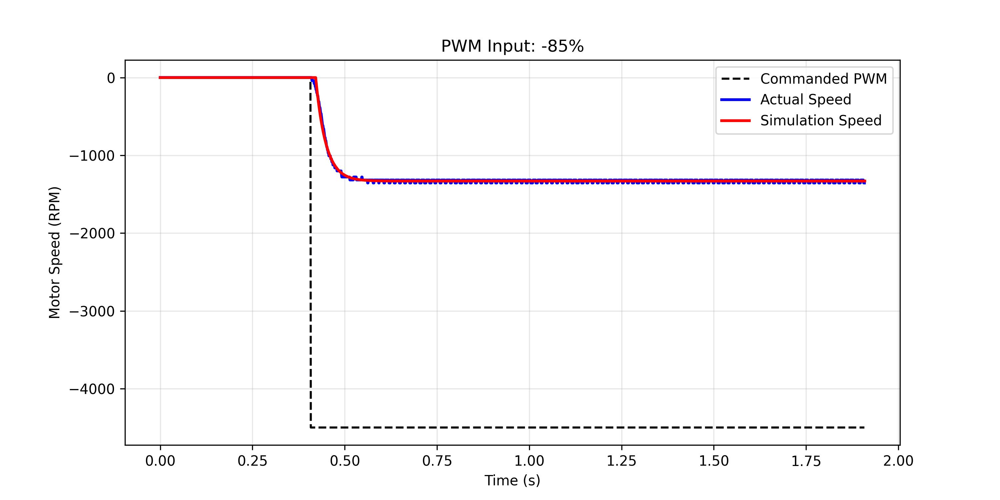
    </td>
  </tr>

  <tr>
    <td align="center"> 98 </td>
    <td> 
        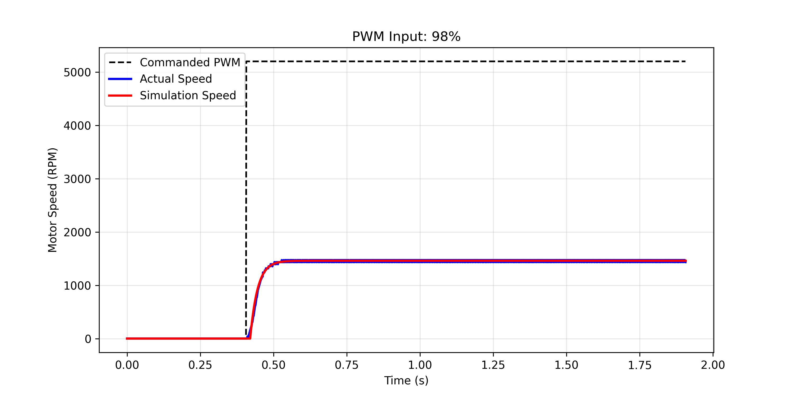
    </td>
    <td> 
        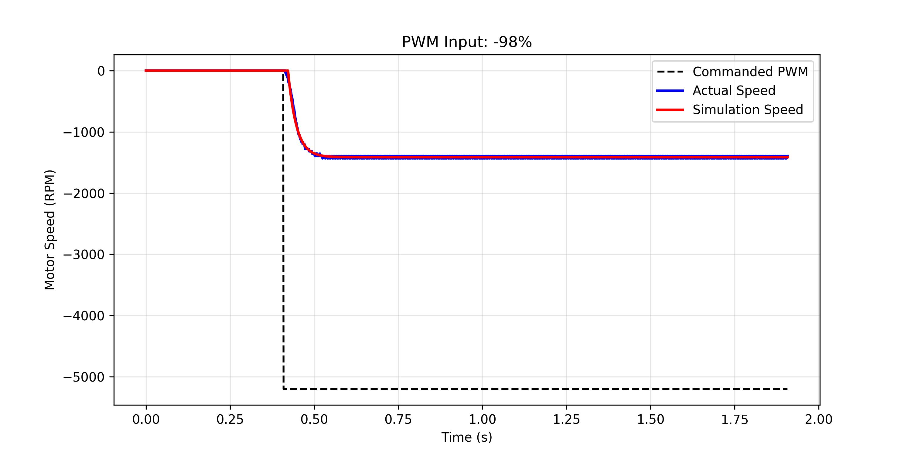
    </td>
  </tr>

</table>

<div align="center">
  <a href="01-Control-Implementation.md"></a>
  
  <a href="../README.md"></a>
  
  <a href="03-Speed-Control.md">>" height="30"></a>
</div>
<div align="center">
  Control Implementation
  
  Speed Control
</div>
    
#
