# System Identification

<div align="center">
  <a href="01-Control-Implementation.md"></a>
  
  <a href="../README.md"></a>
  
  <a href="03-Speed-Control.md">>" height="30"></a>
</div>
<div align="center">
  Control Implementation
  
  Speed Control
</div>
    
#

## Method
Based on the difference equation of DC motor, we can simulate the motor model with the algorithm on the python code listing below. But on this stage we still don't know the exact value of the motor parameters: steady-state gain, time-constant, and time-delay. To get that parameters we need can `directly measured` the motor parameter like Kt, Kb, L, R, J, and B or if we dont interest on the individual parameters then we can perform `numerical optimization` from the motor's open loop response. On this repo we will perform numerical optimization with the `differential_evolution` method from `scipy.optimize`. We can compare the simulation result with the actual motor step response with differents K, tau, and L value, then select the most similar result. The similarity itself is defined by the `minimum Root Mean Squared Error` (RMSE) between the simulation and the actual data. Then we repeat the process for all the different PWM input values.

### Simulation Model

```python
def simulate_open_loop_response(self, params, u: list, dt):        
    '''
        Input u: PWM (Ticks)
        Output y: Motor Speed (Pulse per Second)
    '''
    
    K, tau, L = params
    
    # Simulation Variable
    N     = len(u)        # Number of Data
    d     = int(L / dt)   # Time Delay
    y     = [0.0] * N     # Output: Motor Speed (Pulse per Second)
    
    # Motor Parameters
    ALPHA = np.exp(-dt / tau)
    BETA  = K * (1 - ALPHA)
    
    for k in range(N):
        if (k - d - 1) < 0:
            continue
        # Difference Equation: Update Speed
        y[k] = ALPHA * y[k-1] + BETA * u[k-d-1]
        
    return y

```

## Simulation Result
The graph below shows the result of the system identification process. We can see that there's a deadband for the PWM below 25%. After the deadband to the maximum PWM input, we can see that the time-constant ($\tau$) and time-delay (L) has no significant changes. The average time-constant is 0.0265 seconds, while the average time delay is 0.014 second (14 steps). But for the steady-state gain (K) there's a nonlinearity behaviour based on the PWM input. After the deadband region, the value of K is increasing up to the 85% of the PWM Input, and then decreasing after that up to 100%. To analyzed further about the K, we will convert the graph from PWM vs K to PWM vs Speed.

<div align="center"> 
  </img>
</div>

### Motor Linearity
After we convert the data to PWM vs Motor Speed, we can see that the motor response is not linear for all the input range and not symmetric for different direction of the motor. Please note that the system that we mention here is the combination of the DC Motor and the motor driver. We used this criterion to identify the DC motor region.

<table>
  <tr align = "center">
    <th  align="center">Graph</th>
    <th  align="center" width="250">Description</th>
  </tr>

  <tr align = "center">
    <td  align="center">
      </img>
    </td>
    <td align="left">
      <b>[1] Deadband Zone</b><br>
      At the low PWM input from 0 - 19% the motor is not moving because the current is not enough to overcome the static friction from the motor. Because of that we called this region as the `deadband`, because we cannot get the response. On the DC motor model we assume that the friction on the motor is only the viscous friction, but in reality the motor need to overcome the static coulomb friction from brush, bearing, and gear.<br><br>
      <!--  -->
    </td>
    <tr>
    <td colspan=2>
    <b>[2] Nonlinear Transition</b><br>
      Just after the voltage input is increased, the current is strong enough to move the motor system. But during this transition, the friction constant is still not linear (see `Stribeck Effect`), which also makes the relationship between PWM input and motor speed is not linear. So, if we simulate the motor response on this region (19 - 30% of input) with the linear model, the the result may not accurate. <br><br>
      <!--  -->
      <b>[3] Linear Region</b><br>
      In this region (30 - 75% of input) the friction is fully moved to viscous friction and has a constant value. We can predict the system accurately with linear model on this region. We can estimate the value of K (steady-state constant) of the DC motor by calculating the slope of this region to build the linear model. This is the sweet spot of the DC motor and very recommended to operate and tune the DC motor on this region.<br><br>
      <!--  -->
      <b>[4] Pre-saturation</b><br>
      If we input voltage above 75%, some constant like the back-EMF constant starting to reach the limit and not give a linear response. Beside that, the H-bridge also almost reach the saturation region which resulting the output voltage is hardly to increase. This could also occur on the other components that begin sturate as the response to the temperature change. Because of that we can see that the speed changes is higher than the linear region as shown on the jump value of K on the Figure 1.<br><br>
      <!--  -->
      <b>[5] Saturation</b><br>
      At this point, the input changes cannot increase the motor speed because many components is also saturating. 
    </td>
    </tr>
  </tr>  
</table>

<br>Based on the linearity of the motor, we can get the motor zone based on the PWM and RPM on the table below:

<div align="center">
  <table>
    <tr>
      <th rowspan=2 width=200>Zone</th>
      <th align="center" colspan=2 width=150>PWM (%)</th>
      <th align="center" colspan=2 width=150>RPM</th>
      <th rowspan=2>Criterion</th>
    </tr>
    <tr>
      <th>Min</th>
      <th>Max</th>
      <th>Min</th>
      <th>Max</th>    
    </tr>
    <tr>
      <td>Deadband</td>
      <td>0</td>
      <td>19</td>
      <td>0</td>
      <td>0</td>
      <td>Motor Speed below 15 RPM</td>
    </tr>
    <tr>
      <td>Nonlinear Transition</td>
      <td>19</td>
      <td>30</td>
      <td>0</td>
      <td>450</td>
      <td></td>
    </tr>
    <tr>
      <td>Linear</td>
      <td>30</td>
      <td>75</td>
      <td>450</td>
      <td>1100</td>
      <td>Steady-state Gain (K) changes is below 2.5%</td>      
    </tr>
    <tr>
      <td>Pre-saturation</td>
      <td>75</td>
      <td>90</td>
      <td>1100</td>
      <td>1470</td>
      <td></td>
    </tr>
    <tr>
      <td>Saturation</td>
      <td>90</td>
      <td>100</td>
      <td>1470</td>
      <td>1470</td>
      <td>Speed changes is below 2% </td>
    </tr>            
  </table>
</div>

The table below shows the summary of the system identification process:

<div align="center">
  <table>
    <tr>
      <th rowspan=2 width=150>Parameters</th>
      <th rowspan=2 width=50>Symbol</th>
      <th align="center" colspan=2 width=200>Linear Model</th>
      <th align="center" rowspan=2 width=200>Nonlinear Model</th>
    </tr>
    <tr>
      <th>Positive Direction</th>
      <th>Negative Direction</th>
    </tr>
    <tr>
      <td>Steady-state Gain (pps/ticks)</td>
      <td align="center">K</td>
      <td align="center">0.2059</td>
      <td align="center">0.1963</td>
      <td align="center">Interpolated from System Identification Result</td>       
    </tr>
    <tr>
      <td>Time-constant (s)</td>
      <td align="center">τ</td>
      <td align="center" colspan=3> 0.0265 </td>
    </tr>
    <tr>
      <td>Time-delay (s)</td>
      <td align="center">L</td>
      <td align="center" colspan=3> 0.014 </td>        
    </tr>    
  </table>
</div>
- Notes: pps = pulse per seconds

## Nonlinear Simulation Model
To implement the Nonlinear model, we can use the `interpolation` from stead-state data gain. With this method we can create more accurate for all PWM input. The drawback is the computation process is slower because we need to interpolate the K based on the motor open loop response.

```python    
for k in range(N):
    if (k - d - 1) < 0:
        continue
    
    # Update Motor Gain based on the PWM Input
    K_intrp = interpolate(K_LIST, u[k-d-1])
    BETA    = K_intrp * (1 - ALPHA)
    
    # Difference Equation: Update Speed
    y[k] = ALPHA * y[k-1] + BETA * u[k-d-1]

```

## Verification

The table below shows the comparison between the DC Motor open loop firmware log and the simulation graph.  Based on that, we can say that we have successfully created the simulation model of the DC Motor with the minimum of error that cover for both direction and various speed. For the linear model, we can see that the most accurate model is on the linear region. Outside that, the motor model prediction may be higher or lower than the actual steady-state speed of the motor. But on the other hand, the nonlinear model can predict accurately the motor response from 0 to 100% of PWM input. That's inline with our analysis before and we can say the optimization process is correct.

<div align="center">
  <table>
    <tr align = "center">
      <th  align="center" width=50>PWM Input (%)</th>
      <th  align="center" width=500>Linear Model</th>
      <th  align="center"width=500>Nonlinear</th>
    </tr>
    <tr>
      <td align="center"> Deadband (9%) </td>
      <td> 
          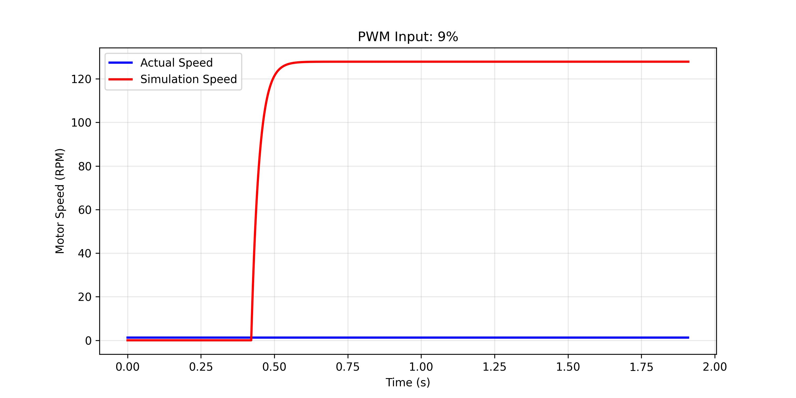
      </td>
      <td> 
          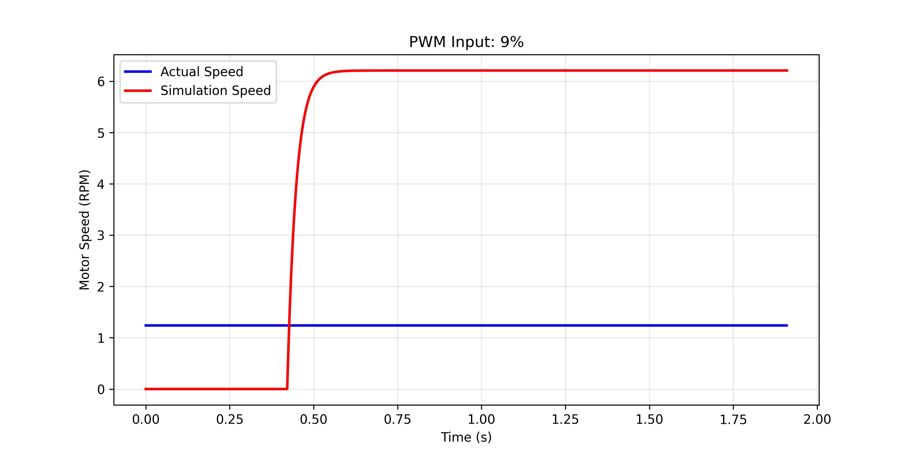
      </td>
    </tr>
    <tr>
      <td align="center"> Nonlinear Transition (24%) </td>
      <td> 
          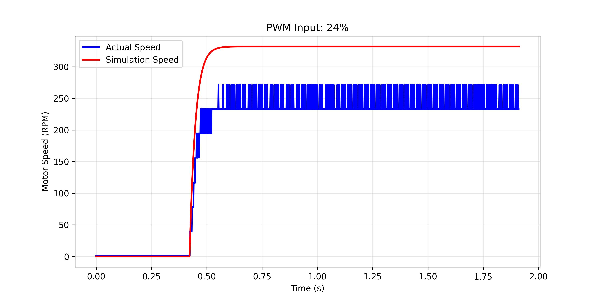
      </td>
      <td> 
          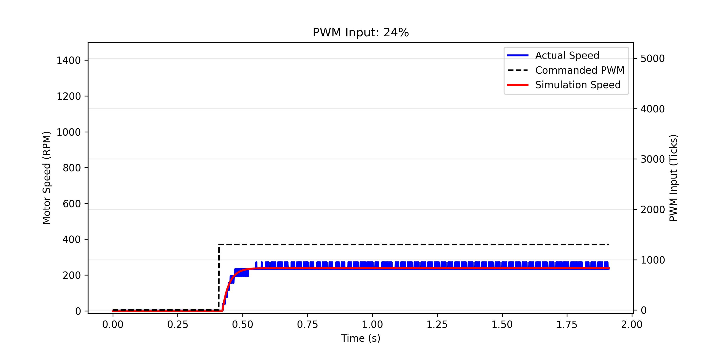
      </td>
    </tr>
    <tr>
      <td align="center" rowspan=2> Linear </td>
      <td></td>
      <td>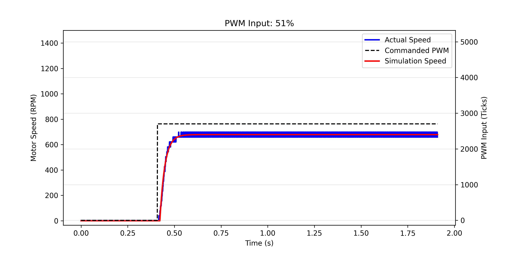</td>
    </tr>
    <tr>
      <td>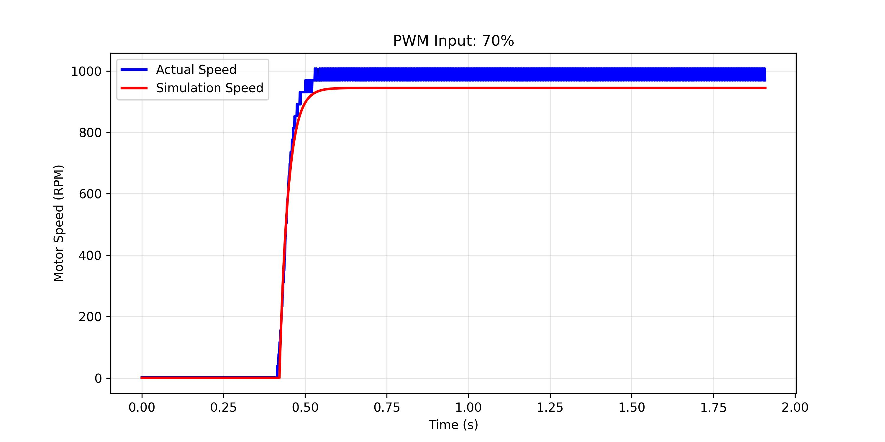</td>
      <td>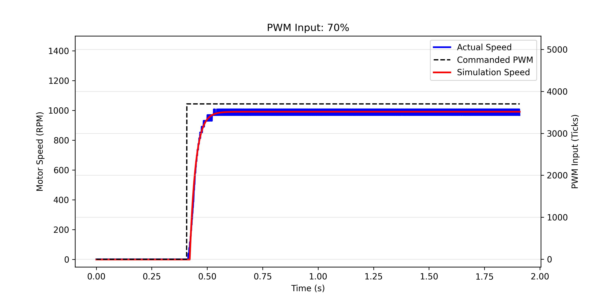</td>
    </tr> 
    <tr>
      <td align="center"> Pre-saturation (81%) </td>
      <td> 
          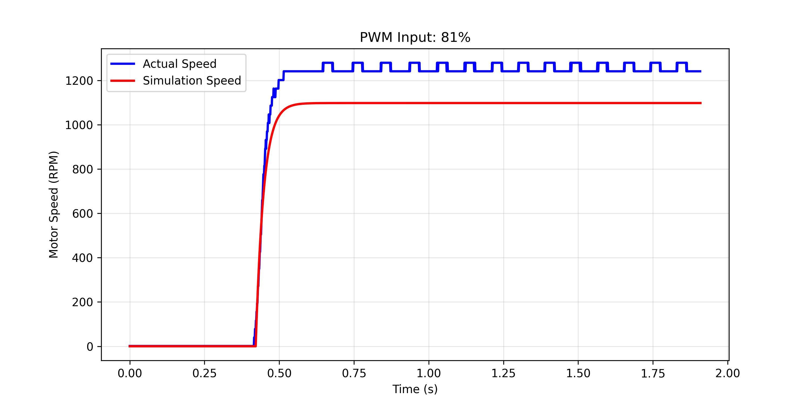
      </td>
      <td> 
          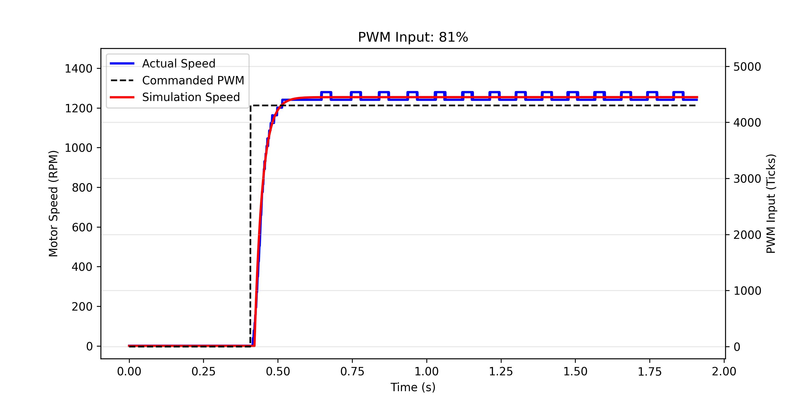
      </td>
    </tr>
    <tr>
      <td align="center" rowspan=2> Saturation </td>
      <td>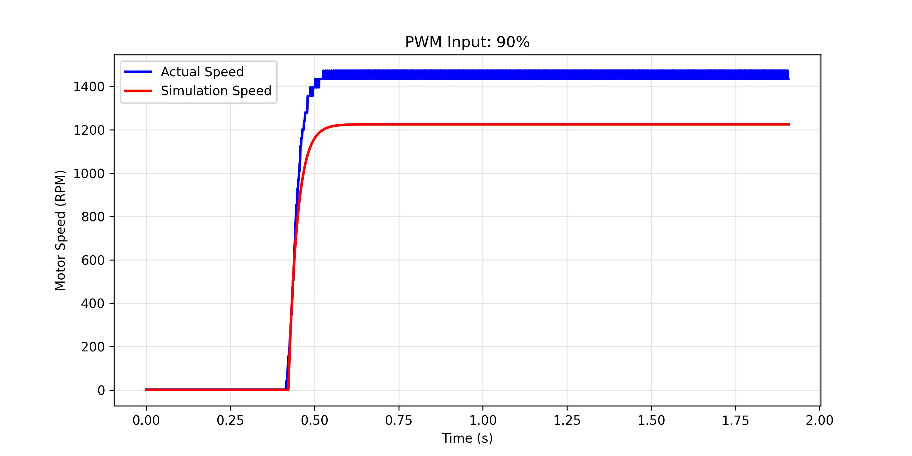</td>
      <td>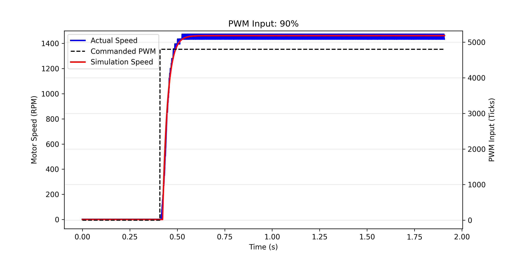</td>
    </tr>
    <tr>
      <td>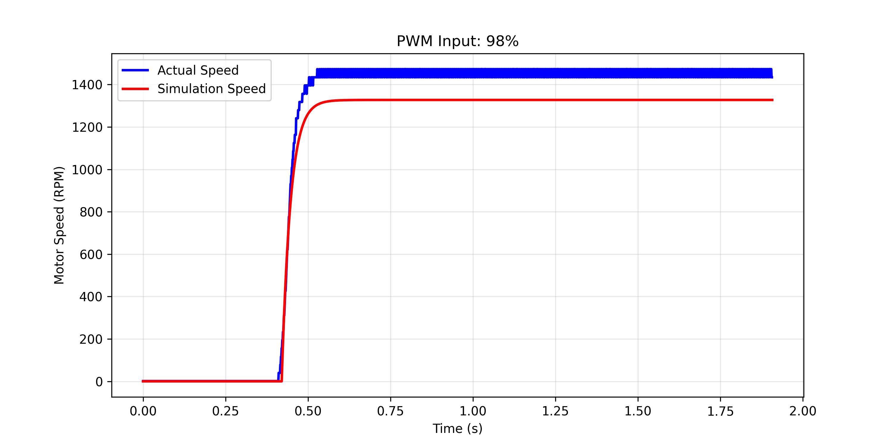</td>
      <td>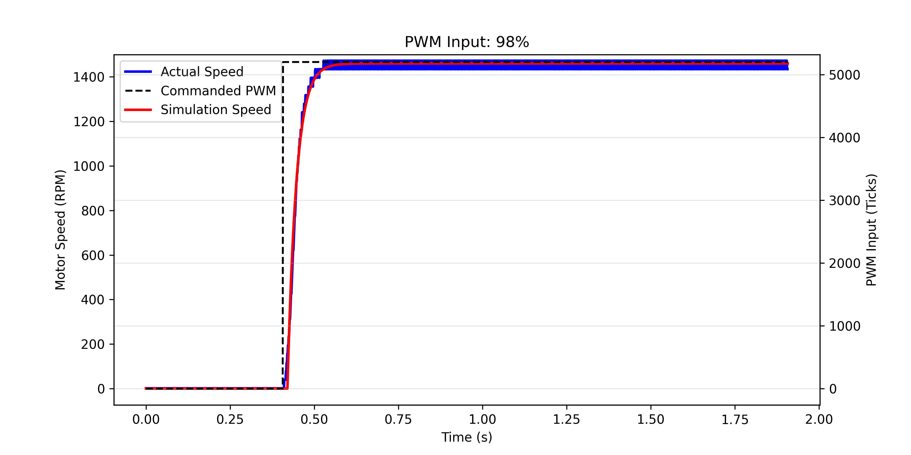</td>
    </tr>
  </table>
</div>

<div align="center">
  <a href="01-Control-Implementation.md"></a>
  
  <a href="../README.md"></a>
  
  <a href="03-Speed-Control.md">>" height="30"></a>
</div>
<div align="center">
  Control Implementation
  
  Speed Control
</div>
    
#
