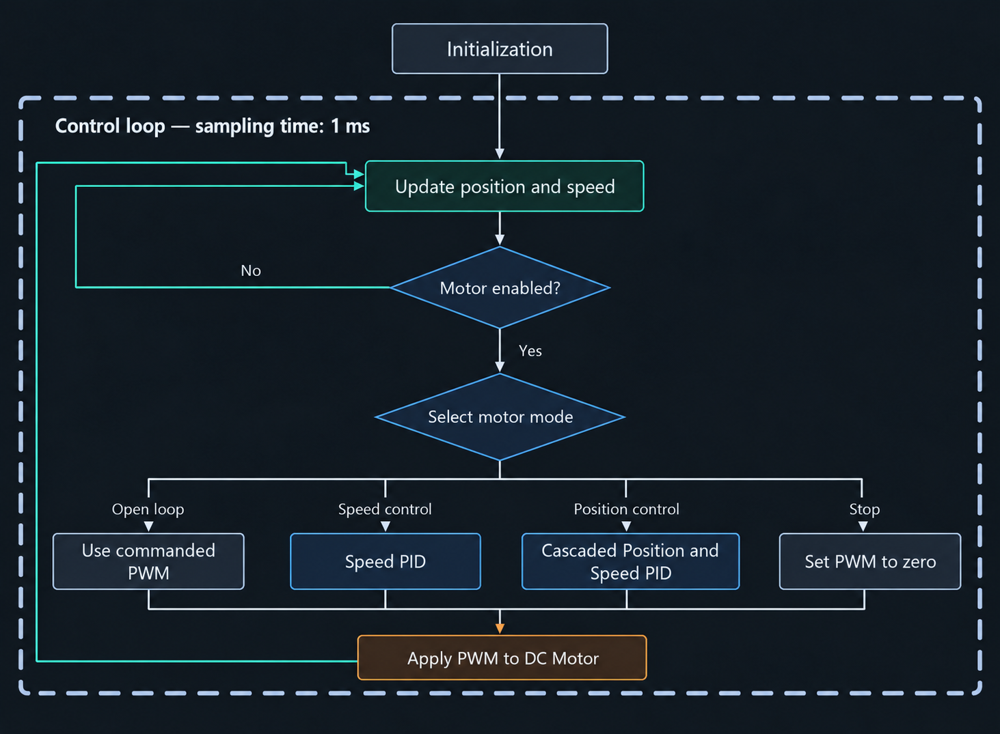

# Control System Implementation on RP2040

<div align="center">
  <a href="02-Control-Design.md"></a>
  
  <a href="../README.md"></a>
  
  <!-- <a href="04-Position-Control.md">>" height="30"></a> -->
</div>
<div align="center">
  Control Design
  
  <!-- Position Control -->
</div>
    
#

## Overview
The **firmware** controls the motor, while **rust_script** simulates its response. Both use the shared PID implementation in `crates/motor-control/`. All components are implemented in Rust. The complete implementations are available here:
- firmware: [`firmware/main/src/tasks/dc_motor.rs`](../firmware/main/src/tasks/dc_motor.rs)
- rust_script: [`rust_script/src/simulation/model.rs`](../rust_script/src/simulation/model.rs)

The table below describes the parameters, variables, types, and methods used in the motor control and simulation examples.

<div align="center">
  Table 1. Motor Control and Simulation Table
  <table>
    <tr>
      <th>Category</th>
      <th>Variable</th>
      <th width=400>Description</th>
      <th>Data Type</th>
    </tr>
    <tr>
      <td rowspan=3>Motor Parameters</td>
      <td>K</td>
      <td>Static gain in (pulses/s) per PWM tick</td>
      <td>f64</td>
    </tr>
    <tr>
      <td>TAU_S</td>
      <td>Time constant in seconds</td>
      <td>f64</td>
    </tr>   
    <tr>
      <td>D_S</td>
      <td>Time delay in seconds</td>
      <td>f64</td>
    </tr>      
    <tr>
      <td rowspan=5>Model Parameters</td>
      <td>DT_S</td>
      <td>Sampling period in seconds</td>
      <td>f64</td>
    </tr>
    <tr>
      <td>d</td>
      <td>
        Delay in whole samples (rounded down) <br>
        <code>(D_S / DT_S) as usize</code>
      </td>
      <td>usize</td>
    </tr> 
    <tr>
      <td>k</td>
      <td>Sample index</td>
      <td>usize</td>
    </tr>          
    <tr>
      <td>alpha</td>
      <td>
        Discrete pole (dimensionless) <br>
        <code>(-DT_S / TAU_S).exp()</code>
      </td>
      <td>f64</td>      
    </tr>     
    <tr>
      <td>beta</td>
      <td>
        Input gain in (pulses/s) per PWM tick <br>
        <code>K * (1.0 - alpha)</code>
      </td>
      <td>f64</td>
    </tr>         
    <tr>
      <td rowspan = 4>Simulation Variable</td>
      <td>set_point</td>
      <td>Requested speed in pulses/s or position in pulses, depending on the control mode</td>
      <td>Vec&lt;f64&gt;</td>
    </tr>    
    <tr>
      <td>u</td>
      <td>Array of signed PWM inputs in ticks</td>
      <td>Vec&lt;f64&gt;</td>
    </tr>
    <tr>
      <td>y</td>
      <td>Array of simulated speeds in pulses/s</td>
      <td>Vec&lt;f64&gt;</td>
    </tr>
    <tr>
      <td>x</td>
      <td>Array of simulated positions in pulses</td>
      <td>Vec&lt;f64&gt;</td>
    </tr>        
    <tr>
      <td rowspan = 2>Control Variable</td>
      <td>speed_control</td>
      <td>PID Speed Control Handler with I16F16</td>
      <td>PIDController&lt;I16F16&gt;</td>
    </tr>
    <tr>
      <td>position_control</td>
      <td>PID Position Control Handler with I32F32</td>
      <td>PIDController&lt;I32F32&gt;</td>
    </tr>
    <tr>
      <td rowspan = 8>Motor Control</td>
      <td>Shape</td>
      <td>
        Enum defining the position command shape:<br>
        <code>Step(i32)</code>: target position in pulses.<br>
        <code>Trapezoidal(I32F32, I32F32, I32F32)</code>:
        target position in pulses, velocity in pulses/s, and acceleration in pulses/s².
      </td>
      <td>enum</td>
    </tr>
    <tr>
      <td>MotorCommand</td>
      <td>
        Enum defining the motor control command:<br>
        <code>SpeedControl(i32)</code>: target speed in pulses per second.<br>
        <code>PositionControl(Shape)</code>: position control using a step or trapezoidal command.<br>
        <code>OpenLoop(i32)</code>: signed PWM input in ticks.<br>
        <code>Stop</code>: set PWM output to zero.
      </td>
      <td>enum</td>
    </tr>
    <tr>
      <td>set_commanded_pos</td>
      <td>Function to store the commanded position in pulses using an <code>AtomicI32</code> store</td>
      <td>Input: i32; Return: ()</td>
    </tr>
    <tr>
      <td>set_commanded_speed</td>
      <td>Function to store the commanded speed in pulses/s using an <code>AtomicI32</code> store</td>
      <td>Input: i32; Return: ()</td>
    </tr>
    <tr>
      <td>get_commanded_pos</td>
      <td>Function to obtain the position setpoint from a step command or the current point of a trapezoidal motion profile</td>
      <td>Input: Shape; Return: i32</td>
    </tr>
    <tr>
      <td>commanded_speed</td>
      <td>Variable containing the requested speed in pulses per second</td>
      <td>i32</td>
    </tr>
    <tr>
      <td>input_shape</td>
      <td>Enum value containing a step position target or trapezoidal motion parameters</td>
      <td>Shape</td>
    </tr>
    <tr>
      <td>max_speed_pps</td>
      <td>Speed-command limit in pulses/s; also bounds the position PID output. It does not guarantee the actual motor speed.</td>
      <td>u32</td>
    </tr>
  </table>
</div>

## Motor Control on `firmware`
The image below shows the motor control flowchart. The loop uses a configured sampling period of 1 ms. At the beginning of each iteration, position and speed are updated for PID feedback. The controller executes the selected mode only when the motor is enabled. Enabling permits movement commands but does not start movement by itself. When the motor task processes a disable request, it sets PWM to zero, resets both PID controllers, and clears queued commands. Position and speed updates continue while disabled.

When enabled, the controller executes the active `MotorCommand`: open loop, speed control, position control, or stop. Each mode passes a signed PWM value to `move_motor`, which clamps its magnitude and selects the motor direction. Stop passes zero PWM.

<div align="center">
  
</div>


The following code blocks are simplified excerpts from `run_motor_task`, not standalone programs. They omit imports, initialization, command reception, configuration updates, and move-completion handling. The position PID is initialized with a speed-output limit, and the speed PID with a PWM-output limit; accepted configuration changes update those limits as needed.

### Open Loop
Open-loop control applies the requested PWM through `move_motor` without using PID feedback.

```rust
MotorCommand::OpenLoop(sig) => {
    // Move Motor
    self.move_motor(sig);
}
```
### Speed Control
The speed PID calculates PWM from the commanded speed and measured speed. The command is clamped to `±max_speed_pps` before the PID calculation. This limits the speed setpoint; it does not guarantee that the measured speed remains within that range during a transient. Commanded-speed telemetry stores the requested value before this clamp.

```rust
MotorCommand::SpeedControl(commanded_speed) => {
    // Update Commanded Speed
    self.motor.set_commanded_speed(commanded_speed);

    // Compute PWM Output
    let commanded_speed = commanded_speed.clamp(
        -(self.max_speed_pps as i32),
        self.max_speed_pps as i32,
    );
    let sig = self.speed_control.compute(commanded_speed, self.current_speed_pps_fixed);

    // Move Motor
    self.move_motor(sig);
}
```

### Position Control
Position control supports step and trapezoidal commands. `get_commanded_pos(input_shape)` generates the position setpoint. The position PID uses this setpoint and position feedback to calculate a target speed, bounded by `max_speed_pps`. The speed PID then uses the target speed and speed feedback to calculate the PWM output.

```rust
MotorCommand::PositionControl(input_shape) => {
    // Update Commanded Position
    let commanded_position = self.get_commanded_pos(input_shape);
    self.motor.set_commanded_pos(commanded_position);

    // Compute Speed Output
    let target_speed = self.position_control.compute(commanded_position, self.current_pos_pulse_fixed);

    // Compute PWM Output
    let sig = self.speed_control.compute(target_speed, self.current_speed_pps_fixed);

    // Move Motor
    self.move_motor(sig);
}
```

### Stop
Stop applies zero PWM and leaves the motor enabled to accept another movement command. Unlike disabling, Stop does not clear the command queue. The simplified excerpt below omits the commanded-position and commanded-speed telemetry updates.

```rust
MotorCommand::Stop => {
    self.move_motor(0);
}
```

## Motor Simulation on `rust_script`

The following simplified examples use a constant gain `K`, with `beta = K * (1.0 - alpha)`, to explain the discrete model. The complete implementation uses separate positive and negative gains for `ModelKind::Linear`, or interpolates gain from signed PWM for `ModelKind::Nonlinear`. Sharing the PID implementation does not make the simulated response identical to the firmware and physical motor.

The examples omit imports, controller configuration, and array allocation. Arrays have the same length and are initialized before the loops: `y` starts at zero and `x` starts at the initial position. For open loop, `u` contains the supplied PWM inputs; for closed loop, `u` starts at zero and is filled by the controller. Set the speed PID output limit to the PWM limit and the position PID output limit to `max_speed_pps`. Speed setpoints and feedback use pulses/s; position uses pulses. Conversion to RPM and rotations is performed for plotting.

The snippets below retain the current simulation's update order. The loops skip samples until the delayed input index is available. In closed-loop simulation, this also skips the initial PID calculations, leaving the initial PWM entries at zero and adding startup delay beyond the plant input delay. This is a known limitation of the current implementation. A future correction would run the PID every sample and apply dead time only to the plant input; that correction is not implemented here.

The identified model describes commanded PWM to filtered measured speed. Integrating that modeled speed for position is an approximation; these examples do not separately reproduce encoder quantization or every firmware state transition.

### Open Loop Simulation
```rust
/* ---------- Open Loop ---------- */
for k in 0..u.len() {
    if (k as i32 - d as i32 - 1) < 0 {
        continue;
    }

    y[k] = alpha * y[k - 1] + beta * u[k - d - 1];
}
```

### Speed Control Simulation
```rust
/* ---------- Speed Control ---------- */
for k in 0..set_point.len() {
    if (k as i32 - d as i32 - 1) < 0 {
        continue;
    }

    let target_speed = (set_point[k] as i32).clamp(-(max_speed_pps as i32), max_speed_pps as i32);
    u[k] = speed_control.compute(target_speed, I16F16::from_num(y[k - 1])) as f64;

    y[k] = alpha * y[k - 1] + beta * u[k - d - 1];
}
```
### Position Control Simulation

```rust
/* ---------- Position Control ---------- */
for k in 0..set_point.len() {
    if (k as i32 - d as i32 - 1) < 0 {
        continue;
    }

    let target_speed = position_control.compute(set_point[k] as i32, I32F32::from_num(x[k - 1]));
    u[k] = speed_control.compute(target_speed, I16F16::from_num(y[k - 1])) as f64;

    y[k] = alpha * y[k - 1] + beta * u[k - d - 1];
    x[k] = x[k - 1] + ((y[k - 1] + y[k]) / 2.0) * DT_S;
}
```


## Motor Control and Simulation Result

The figures below are retained comparison plots. The current host routines in [`script.rs`](../rust_script/src/program/script.rs) select `ModelKind::Nonlinear` and read the active PID settings and maximum speed from the device for their closed-loop overlays. Those current settings should not be assumed to be the settings used for every saved figure.

For a reproducible comparison, record the speed and position PID gains and integral limits, speed and PWM limits, model selection, sampling period, initial state, firmware/source revision, and test conditions alongside the source log. The existing figures are not regenerated by edits to the simulation code; their original settings and simulation revision must be established before making numerical accuracy claims.

Compare the measured and simulated rise time, overshoot, settling time, steady-state error, and behavior in both directions. Speed plots use RPM and position plots use rotations, while the controller calculations use pulses/s and pulses. A close visual overlay is qualitative evidence for the displayed case, not proof of accuracy over the full operating range.

### Speed Control Result
<table>
  <tr align = "center">
    <th  align="center" width=50>Speed (RPM)</th>
    <th  align="center">Positive Direction</th>
    <th  align="center">Negative Direction</th>
  </tr>

  <tr>
    <td align="center"> 100 </td>
    <td> 
        
    </td>
    <td> 
        
    </td>
  </tr>

  <tr>
    <td align="center"> 200 </td>
    <td> 
        
    </td>
    <td> 
        
    </td>
  </tr>

  <tr>
    <td align="center"> 300 </td>
    <td> 
        
    </td>
    <td> 
        
    </td>
  </tr>

  <tr>
    <td align="center"> 400 </td>
    <td> 
        
    </td>
    <td> 
        
    </td>
  </tr>

  <tr>
    <td align="center"> 500 </td>
    <td> 
        
    </td>
    <td> 
        
    </td>
  </tr>

  <tr>
    <td align="center"> 600 </td>
    <td> 
        
    </td>
    <td> 
        
    </td>
  </tr>

  <tr>
    <td align="center"> 700 </td>
    <td> 
        
    </td>
    <td> 
        
    </td>
  </tr>

  <tr>
    <td align="center"> 800 </td>
    <td> 
        
    </td>
    <td> 
        
    </td>
  </tr>

  <tr>
    <td align="center"> 900 </td>
    <td> 
        
    </td>
    <td> 
        
    </td>
  </tr>

  <tr>
    <td align="center"> 1000 </td>
    <td> 
        
    </td>
    <td> 
        
    </td>
  </tr>

  <tr>
    <td align="center"> 1100 </td>
    <td> 
        
    </td>
    <td> 
        
    </td>
  </tr>

  <tr>
    <td align="center"> 1200 </td>
    <td> 
        
    </td>
    <td> 
        
    </td>
  </tr>

</table>

### Position Control Result

<table>
  <tr align = "center">
    <th  align="center" width=50>Position (rotation)</th>
    <th  align="center">Positive Direction</th>
    <th  align="center">Negative Direction</th>
  </tr>

  <tr>
    <td align="center"> 5 </td>
    <td> 
        
    </td>
    <td> 
        
    </td>
  </tr>

  <tr>
    <td align="center"> 50 </td>
    <td> 
        
    </td>
    <td> 
        
    </td>
  </tr>

  <tr>
    <td align="center"> 200 </td>
    <td> 
        
    </td>
    <td> 
        
    </td>
  </tr>

  <tr>
    <td align="center"> 1000 </td>
    <td> 
        
    </td>
    <td> 
        
    </td>
  </tr>

</table>

#
<div align="center">
  <a href="02-Control-Design.md"></a>
  
  <a href="../README.md"></a>
  
  <!-- <a href="04-Position-Control.md">>" height="30"></a> -->
</div>
<div align="center">
  Control Design
  
  <!-- Position Control -->
</div>
    
#
