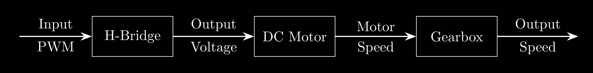
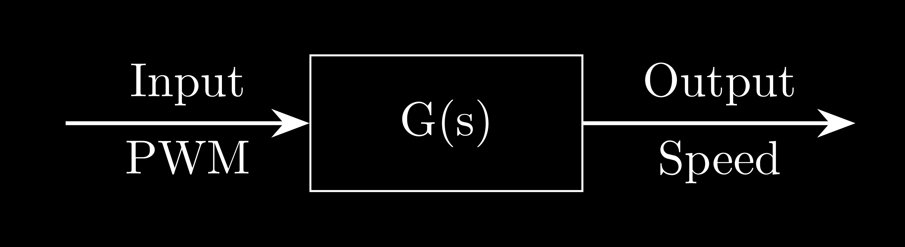
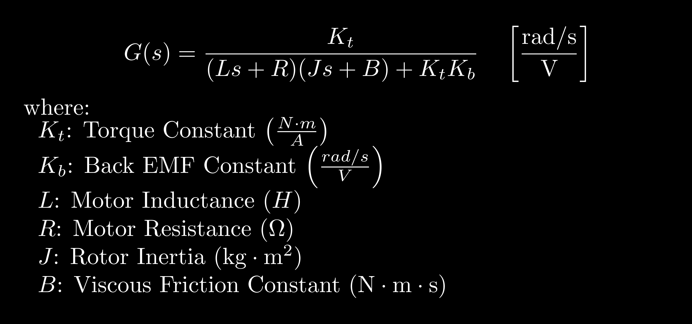
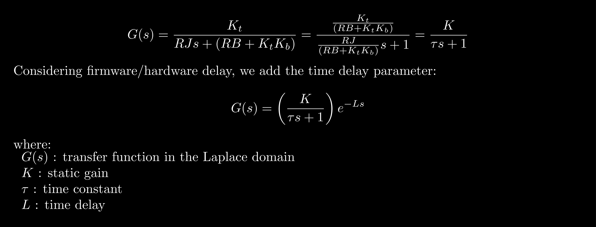

# DC Motor System

  
  
  
  
  <a href="01-Control-Implementation.md">>" height="30"></a>

  Home
  
  Control Implementation

    
#

## Transfer Function
In order to characterize and optimize the parameter control of a DC motor, we need the mathematical model to simulate the DC motor behaviour. The DC Motor block diagram in this project is shown on the picture below:

 
  </img>

In this project we only interest with the dynamic response between the input PWM and output speed. Because of that, the term `system` on this project is refer to the combination of H-Bridge, DC Motor, and Gearbox system. The picture below shows the block diagram between the input and the output that we want to identify.

 
  </img> 

If we derive the mathematical model from the mechanical and electrical system, we get the `second-order system` model:

 
  </img> 

Depends on the aplication, if we need to accurately model the DC Motor then we need to get all of those paraemters. There's several ways to get those DC Motor Parameter:
* Ideally, if the DC motor manufacturer list all of those parameters then we can easily model the DC motor. 
* On the other hand if we cannot get the specification, we can measure all the motor parameters experimentally one by one. But please take a not that not all parameters is easy to measure, especially for $J$ and $B$ because they are dynamic.  
* System identification by collecting the open-loop response between output speed and input PWM then perform numerical-method optimization to estimate the mathematical equation that represent the open-loop data.

In this project we will not measure all parameters because we dont need to identify the parameters one by one. Because of that, we will perform the system identification by using the optimization process.

## DC Motor Model Modification
Based on the discussion above the DC Motor can be described as the `second-order system` which generated from 6 parameters. We can reduced the system order by eliminating the least significant parameters. If we look back to the second-order model we found that we have two types of time constant: (1) electrical time-constant $\tau_e = L/R$ and (2) mechanical time-constant $\tau_m = J/B$. Typically the ratio between $\tau_m$ and $\tau_e$ on DC Motor with gearbox could be 100 to more than 1000 because the $L$ is usually very small an the $J$ is getting higher with the gearbox.

Because of that we can reducing the order to the `first-order system` to form this equation:

 
  </img> 

By using that model we can identify the DC Motor by only three parameters. This is the common model that usually used to identify the DC Motor in real life.

## Discrete-Time System Model
To works with the embedded system, we need to works in the discrete system. One method that usually usefull to transform the transfer function to the discrete-time transfer function $G(z)$ is by using the Zero-order Hold (ZOH) Method and then transform it to the difference equation. To do that, we can use this equation to transform the $G(s)$ to $G(z)$.

 
  </img> 

Notes: The time sampling must be constant

By using that difference equation we can construct the algorithm to simulate the DC Motor. The remaining problem is we need to characterize the value of $K$, $\tau$, and $L$. The plan is we need to collect the open-loop data from the real DC Motor and perform numerical-method with three input variables to optimize the value the DC Motor parameter.

  
  
  
  
  <a href="01-Control-Implementation.md">>" height="30"></a>

  Home
  
  Control Implementation

    
#
