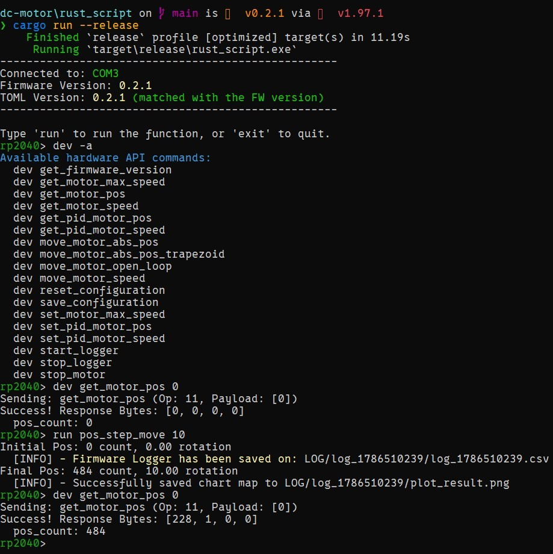

# Rust Script — DC Motor Host

<div align="center">
  <a href="../README.md"></a>
  <br>DC Motor Desktop Application
</div>

## Project Overview

`rust_script` is the desktop application to communicate with the RP2040 through
USB serial communication. We use this application to call the firmware API,
create high-level motor experiments, collect firmware logs, and compare the
measured response with a motor model.

The low-level control runs on the firmware. The desktop script organizes the
experiment: set the command, collect the response, save the CSV, and create the
plot.

<p align="center">
  
  <br>Fig 1. DC Motor Host Application
</p>

## Project Structure

```text
rust_script/
├── Cargo.toml              # Desktop dependencies
├── build.rs                # Generate firmware API, routine menu, and motor constants
├── src/
│   ├── main.rs             # Initialize resources and start the CLI
│   ├── apps/               # CLI commands and autocomplete
│   ├── board/              # USB connection, responses, events, and telemetry
│   ├── basic_function/     # Motor wrapper, unit conversion, and routine cleanup
│   ├── config/             # Load shared motor constants and nonlinear-model data
│   ├── program/
│   │   ├── script.rs       # Write custom experiment routines here
│   │   └── macros.rs       # Shared-resource access through try_lock!
│   ├── logger/             # Collect firmware telemetry and export CSV
│   ├── simulation/         # Calculate the expected motor response
│   ├── plotter/            # Plot measured and simulated responses
│   └── tool/               # Read and process CSV data
└── LOG/                    # Generated experiment results
```

The application also uses these files from the repository root:

| File | Purpose |
| :--- | :--- |
| [DeviceOpFuncs/DCMotor.toml](../DeviceOpFuncs/DCMotor.toml) | Firmware API: command names, opcodes, arguments, responses, and telemetry scaling. |
| [config/motor_config.toml](../config/motor_config.toml) | Shared motor properties, model parameters, PID defaults, and host timeouts. |
| [config/system_identification.csv](../config/system_identification.csv) | Selected data for the nonlinear motor model. |

## Build and Run

Use a Rust toolchain that supports this project's dependencies and edition 2024.
From the repository root, enter the desktop application directory:

```powershell
cd rust_script
cargo check --locked
cargo build --release --locked
```

These commands compile the application without connecting to the RP2040.
To start the application, run this command from the same directory:

```powershell
cargo run --release --locked
```

Starting the application automatically searches for a USB device with a serial
number beginning with `12345678` and checks its firmware version against
`DCMotor.toml`. Keep the application in this directory when launching it; the
protocol file and output paths are relative to the working directory.

If no matching device is found, or its firmware version does not match, the
application uses connection simulation mode. This mode is useful for checking
the CLI, but it does not produce firmware telemetry. A logged routine can
therefore return `No Data Collected`.

## Using the CLI

There are two command groups: `dev` calls the firmware API directly, while
`run` calls the high-level routines in [script.rs](src/program/script.rs).
Type the following commands at the `rp2040>` prompt, without the prompt itself.

<div align="center">
  <table>
    <tr>
      <th align="center">Command</th>
      <th align="center">Description</th>
    </tr>
    <tr><td><code>dev -a</code></td><td>Show available firmware API commands.</td></tr>
    <tr><td><code>dev &lt;command&gt; &lt;arguments...&gt;</code></td><td>Call a firmware API using its raw units.</td></tr>
    <tr><td><code>run -a</code></td><td>Show available high-level routines.</td></tr>
    <tr><td><code>run &lt;routine&gt; &lt;arguments...&gt;</code></td><td>Run an experiment defined in <code>script.rs</code>.</td></tr>
    <tr><td><code>exit</code>, <code>quit</code>, <code>q</code></td><td>Close the application.</td></tr>
  </table>
</div>

### Firmware API

For example, read the firmware version, motor position, and speed PID settings:

```text
rp2040> dev get_firmware_version
rp2040> dev get_motor_pos 0
rp2040> dev get_pid_motor_speed 0
```

The `0` is the motor ID. Argument order and types follow `DCMotor.toml`.
Raw position is in encoder pulses, raw speed is in pulses per second (pps),
and raw PWM is in signed ticks.

### Motor Routines

The built-in routines use `shared.m0`. The current host selects motor ID `0`
through the local `MOTOR_ID` constant in [main.rs](src/main.rs); changing the
shared TOML's `MOTOR_ID` alone does not change this selection.

| Routine | Arguments | Description |
| :--- | :--- | :--- |
| `enable_motor` | None | Enable the motor if it is disabled. |
| `open_loop` | `<percent>` | Apply signed PWM percent for 1500 ms. Input is clamped to -100 through 100%. |
| `speed_move` | `<target_rpm>` | Apply a closed-loop speed command for 1500 ms. |
| `pos_step_move` | `<target_rotation>` | Move to an absolute position in output-shaft rotations. |
| `pos_trapezoid_move` | `<target_rotation> <speed_rpm> <acc_pps2>` | Move to an absolute position with a trapezoidal or triangular profile. Acceleration is in pulses/s². |

For example, the syntax for a position experiment is:

```text
rp2040> run enable_motor
rp2040> run pos_trapezoid_move 1.0 100.0 500
```

This example commands an absolute position of 1 rotation, with a speed setting
of 100 RPM and acceleration of 500 pulses/s². Choose values suitable for the
actual mechanism before running it. Movement routines do not enable the motor
automatically.

To stop or disable motor 0 through the firmware API:

```text
rp2040> dev stop_motor 0
rp2040> dev set_motor_disable 0
```

**Shutdown behavior:** typed `exit`, `quit`, and `q` currently close the CLI
without motor cleanup. Ctrl+C at the prompt or end-of-input attempts cleanup
for motor 0, but does not guarantee that it succeeds. Stop and disable the
motor before exiting; disconnecting USB is not a motor stop.

## Create a Custom Routine

Add a public function to [src/program/script.rs](src/program/script.rs).
The file already imports the common tools through `use super::*`.
For example, add a routine to read and display the motor position:

```rust
pub fn read_position() -> DefaultResult<()> {
    let shared = SHARED.get().expect("Shared resources not initialized!");
    let position = try_lock!(shared.m0 => get_motor_pos())??;

    println!("Motor position: {position}");
    Ok(())
}
```

Rebuild and restart the application. The function is then available as:

```text
rp2040> run read_position
```

`build.rs` scans the public functions and generates the routine menu and
argument parsing. There is no separate menu entry to maintain. For functions
with arguments, use simple types such as `f64`, `i32`, or `u64`; the CLI follows
their order in the function signature. Keep helper functions private with
`fn` so they are not added to the menu. The scanner reads text rather than a
full Rust syntax tree, so avoid complex signatures and commented-out public
function examples in `script.rs`.

### Shared Resources and Error Handling

| Resource | Purpose |
| :--- | :--- |
| `shared.m0` | Motor wrapper with unit conversion and movement helpers. |
| `shared.pico` | Direct access to the generated firmware API. |
| `shared.logger` | Start logging, select exported signals, and save the CSV. |

`try_lock!` locks a shared resource for one method call, then releases it.
The first `?` handles a lock error. If the method also returns a `Result`, the
second `?` handles that method's error. For example:

```rust
try_lock!(shared.m0 => clear_motor_event())?;
let position = try_lock!(shared.m0 => get_motor_pos())??;
```

`DefaultResult<()>` means the routine returns either success without a value
or an error. Use `?` to propagate errors to the CLI.

### Movement and Logging Workflow

Use the existing `open_loop` or `speed_move` routine as the starting point for
a new experiment. Their workflow is:

1. Select the telemetry signals and sampling interval.
2. Clear old movement events and start the logger.
3. Run the movement inside a closure that returns `DefaultResult<()>`.
4. Pass the movement result to `finalize_motor_routine`.
5. Load the saved CSV, calculate the model response, and create the plot.

For example, this is the cleanup pattern used after logging has started:

```rust
let move_status = (|| -> DefaultResult<()> {
    try_lock!(shared.m0 => move_motor_speed(Speed::from_rpm(target_speed)))??;
    wait_ms(duration_ms);
    Ok(())
})();

let (log_dir, file_dir) =
    finalize_motor_routine(&shared.m0, &shared.logger, move_status)?;
```

Keeping the movement error in `move_status` lets cleanup run before returning
the error. The helper attempts to stop the motor, attempts priority disable if
that stop fails, and stops the logger. It reports movement and cleanup errors
together. Position routines use `wait_move_done` with a timeout inside the same
pattern.

## Motor Configuration

Edit [config/motor_config.toml](../config/motor_config.toml) for shared motor
settings. Its keys match the generated Rust constant names, such as `DT_S`,
`MAX_PWM_TICKS`, and `DEFAULT_PID_SPEED_CONFIG`. Short usage examples are in
the TOML comments and [motor_config.rs](src/config/motor_config.rs).

All values are stored explicitly. Formula comments are references only, so
update related values together. Rebuild the Rust application after changing
the TOML or the selected [system_identification.csv](../config/system_identification.csv).
`build.rs` generates the motor constants in Cargo's build output; edit the
shared TOML rather than that generated file.

These settings control host conversions and model behavior. They do not update
firmware defaults or device flash. The built-in closed-loop routines read PID
settings and maximum speed from the device for their model comparison.

## Logs and Model Comparison

Successful logged experiments save their results under the working directory:

```text
LOG/
└── log_<timestamp>/
    ├── log_<timestamp>.csv
    └── plot_result.png
```

`LogMask` selects the exported signals. The CSV uses milliseconds, rotations,
RPM, and PWM ticks according to the telemetry definitions in `DCMotor.toml`.
For example, `open_loop` records commanded PWM and measured motor speed.

The built-in plots use `ModelKind::Nonlinear`. This model interpolates gain
from the selected identification CSV and uses the time constant and delay from
the shared TOML. `ModelKind::Linear` uses the configured directional gains.
These are calculated response overlays; they are separate from the connection
simulation mode used when no compatible device is available.

To fit a new model from saved open-loop logs, follow the
[System Identification tool guide](../system_identification/README.md).
Review its results before manually updating the shared settings or selected
dataset.

## Further Documentation

- [Project Architecture](../README.md)
- [Firmware](../firmware/README.md)
- [System Identification](../docs/01-System-Identification.md)
- [Control Design](../docs/02-Control-Design.md)
- [Control Implementation](../docs/03-Control-Implementation.md)

When adding a firmware command, update `DCMotor.toml` and the firmware handler
together. The host generates its API from the TOML, while firmware command
handling is maintained separately.
